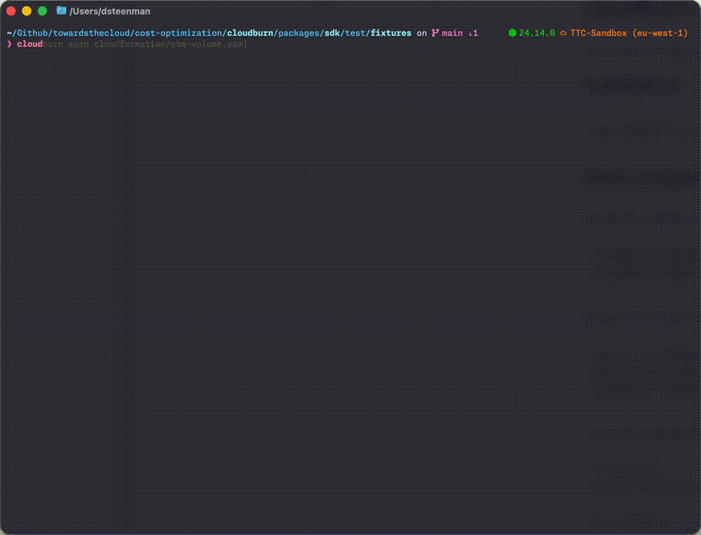
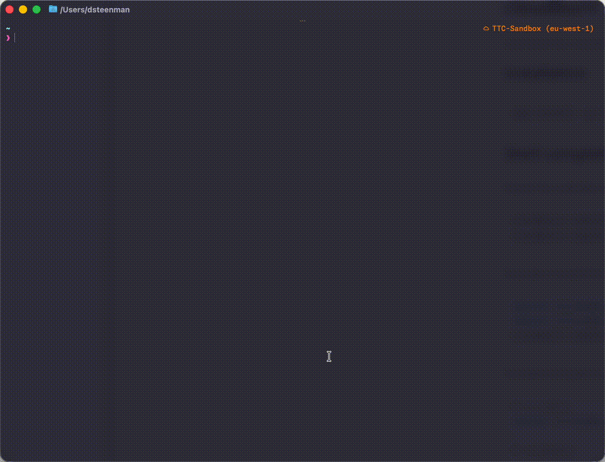

[](https://cloudburn.io)
<div align="center">
<p align="center">
  Open-source policy engine that blocks bad AWS spending patterns before they ship and remediates what's already burning.
  <br /><br />
</p>

[](https://github.com/towardsthecloud/cloudburn/actions/workflows/ci.yml)
[](https://github.com/towardsthecloud/cloudburn/blob/main/LICENSE)
[](https://badge.fury.io/js/cloudburn)

[Changelog](https://cloudburn.io/changelog) | [Documentation](https://cloudburn.io/docs) | [Discord](https://discord.gg/CKKK5FRW3n)

</div>

CloudBurn runs deterministic cost rules against your Terraform and CloudFormation with `scan`, then runs those same rules against your live AWS account with `discover`. Wire it into CI to catch waste before deploy. Point it at a running account to find what's still burning money.

## Features

- **One rules engine, two modes.** Same rules for IaC and live AWS. See the [rule list](docs/reference/rule-ids.md).
- **Scan in CI.** Checks Terraform and CloudFormation in pull requests, CI jobs, and release pipelines.
- **Discover in production.** Inspects deployed resources and shows what needs fixing.
- **Programmable.** The [SDK](packages/sdk/README.md) lets you run CloudBurn inside your own tooling.
- **Machine and human friendly output.** `json` and `table` formats.

## See It Run

### IaC scan



### Live discovery



## Installation

### Homebrew (macOS/Linux)

```bash
brew install towardsthecloud/tap/cloudburn
```

This installs Node.js automatically if you don't have it.

### npm

Requires Node.js 24+.

```bash
npm install --global cloudburn
```

Or run it without installing:

```bash
npx cloudburn scan ./main.tf
```

## Getting Started

### Config

Config is optional. By default, CloudBurn runs all checks for the mode you use.

Create a starter config:

```bash
cloudburn config --init
```

Inspect the current discovered config file:

```bash
cloudburn config --print
```

Inspect the starter template without writing a file:

```bash
cloudburn config --print-template
```

CloudBurn reads `.cloudburn.yml` or `.cloudburn.yaml`. By default it searches upward from the current directory until it finds a config file or reaches the git root. In CI, implicit config discovery is skipped entirely; use `--config <path>` on `scan` or `discover` to opt into an exact file instead.

```yaml
iac:
  enabled-rules:
    - CLDBRN-AWS-EBS-1
    - CLDBRN-AWS-RDS-1
  disabled-rules:
    - CLDBRN-AWS-EC2-2
  format: table

discovery:
  enabled-rules:
    - CLDBRN-AWS-EBS-1
  disabled-rules:
    - CLDBRN-AWS-S3-1
  format: json
```

- Use `enabled-rules` when you want a mode to run only a specific set of rules.
- Use `disabled-rules` when you want to subtract a few rules from the active set.
- Use stable public rule IDs like `CLDBRN-AWS-EBS-1`.
- Use `--config <path>` if you want `scan` or `discover` to load a specific config file.

### Scan

Point `scan` at your IaC files. It checks Terraform (`.tf`) and CloudFormation (`.yaml`, `.json`).

```bash
cloudburn scan ./main.tf
cloudburn scan ./template.yaml
cloudburn scan ./iac --exit-code
cloudburn --format json scan ./iac
```

### Discover

`discover` runs the same rules against live AWS resources. Initialize AWS Resource Explorer first, then run against the current AWS region or one explicit region.

```bash
cloudburn discover init
cloudburn discover
cloudburn discover --region eu-central-1
cloudburn discover --service ec2,s3
cloudburn --debug discover --region eu-central-1
```

The CLI targets one region at a time. Multi-region discovery remains available through the SDK.
Use `--debug` to relay SDK and provider execution trace details to `stderr` while keeping normal command output on `stdout`.

Generate a starter config with `cloudburn config --init`. Full details in the [config reference](docs/reference/config-schema.md).

## AWS Permissions

CloudBurn needs Resource Explorer read/write access plus read-only permissions for the services behind the rules you enable (EC2, EBS, RDS, S3, Lambda, CloudTrail, CloudWatch, etc.). Which permissions you need depends on which rules you're running.

## Contributing

Want to help? Start with [CONTRIBUTING.md](CONTRIBUTING.md).

## License

[Apache-2.0](LICENSE)
