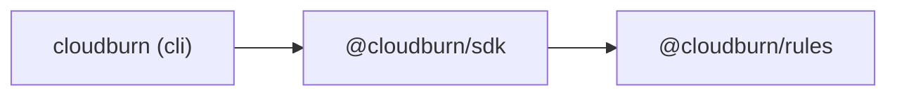
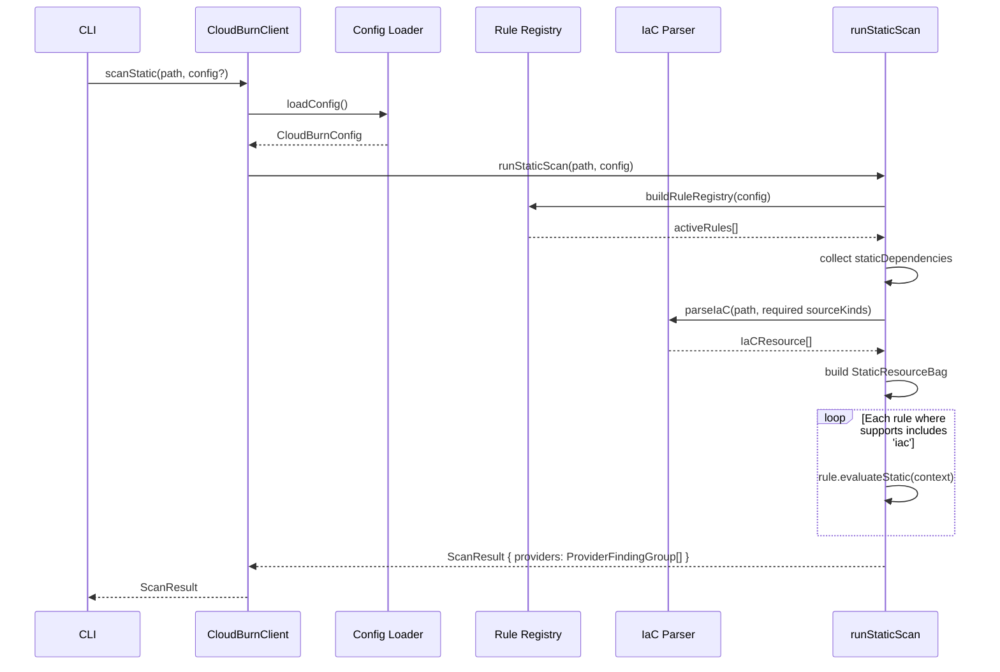
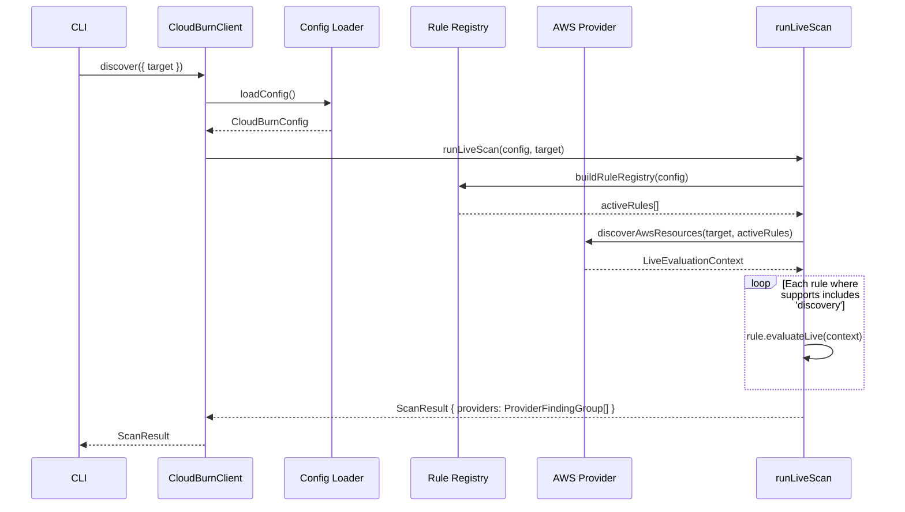

# CloudBurn Architecture

High-level view of the monorepo. Detailed per-package diagrams live in `docs/architecture/`.

## Package Dependency Graph

Dependency direction is strictly left-to-right. No reverse imports. Enforced by Turborepo `boundaries` in `turbo.json`.

## Scan Data Flow

### Static (IaC) Scan

### Live (AWS Discovery) Scan

## Package Responsibility

| Package            | Owns                                                                        | Does NOT own                     |
| ------------------ | --------------------------------------------------------------------------- | -------------------------------- |
| `cloudburn` (cli)  | Command parsing, output formatters, exit-code behavior                      | Scanning logic, rule definitions |
| `@cloudburn/sdk`   | Scanner facade, config system, engine orchestration, parsers, AWS providers | Rule definitions, CLI concerns   |
| `@cloudburn/rules` | Rule definitions, presets, type contracts, helper utilities                 | I/O, AWS SDK calls, engine logic |

Static IaC scans and live AWS discovery now follow the same dataset-driven pattern. Static rules declare `staticDependencies`, live rules declare `discoveryDependencies`, and the SDK resolves both into normalized datasets exposed through `StaticResourceBag` and `LiveResourceBag`. The CLI keeps `scan` static-only and uses `discover` for live AWS evaluation and setup flows.

## Multi-Cloud Strategy

AWS is the active provider. Azure and GCP namespaces are scaffolded in `@cloudburn/rules` (empty typed arrays) for future expansion. Rule metadata is provider-aware (`provider: 'aws' | 'azure' | 'gcp'`).
