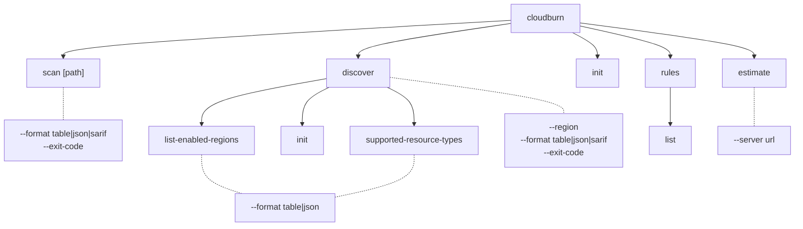
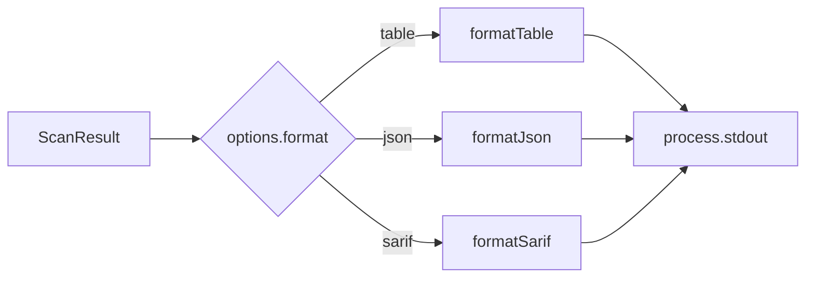

# CLI Architecture (`packages/cloudburn`)

## Command Tree



## Formatter Pipeline



All rule-evaluation formatters share the signature `(result: ScanResult) => string`.

| Formatter     | Output |
| ------------- | ------ |
| `formatJson`  | Pretty JSON preserving the lean `providers -> rules -> findings` contract |
| `formatTable` | One flattened line per nested match: `provider ruleId source service resourceId [location] message` using rule-group metadata plus nested finding data |
| `formatSarif` | SARIF 2.1.0 JSON flattened from nested matches |

## Command Behavior

- `scan [path]` is static IaC only. It accepts a Terraform file, CloudFormation template, or directory and calls `CloudBurnClient.scanStatic(path)`.
- `discover` runs live AWS discovery and rule evaluation through `CloudBurnClient.discover({ target })`.
- `discover --region all` requires a Resource Explorer aggregator index.
- `discover --region <region>` targets one enabled Resource Explorer index region.
- `discover list-enabled-regions` and `discover supported-resource-types` use table or JSON output only.
- `discover init` bootstraps Resource Explorer through the SDK and prints a short status message.
- `--exit-code` counts nested matches across all provider and rule groups.

### Help Examples

```text
cloudburn scan ./main.tf
cloudburn scan ./template.yaml
cloudburn scan ./iac
cloudburn discover
cloudburn discover --region eu-central-1
cloudburn discover --region all
cloudburn discover list-enabled-regions
cloudburn discover init
```

## Exit-Code Contract

| Constant                     | Value | Meaning |
| ---------------------------- | ----- | ------- |
| `EXIT_CODE_OK`               | `0`   | Clean run, no findings, or `--exit-code` not set |
| `EXIT_CODE_POLICY_VIOLATION` | `1`   | At least one nested finding exists and `--exit-code` was passed |
| `EXIT_CODE_RUNTIME_ERROR`    | `2`   | Reserved for runtime failures |
