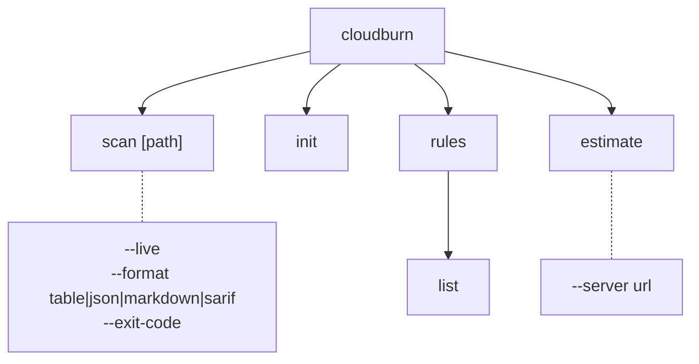
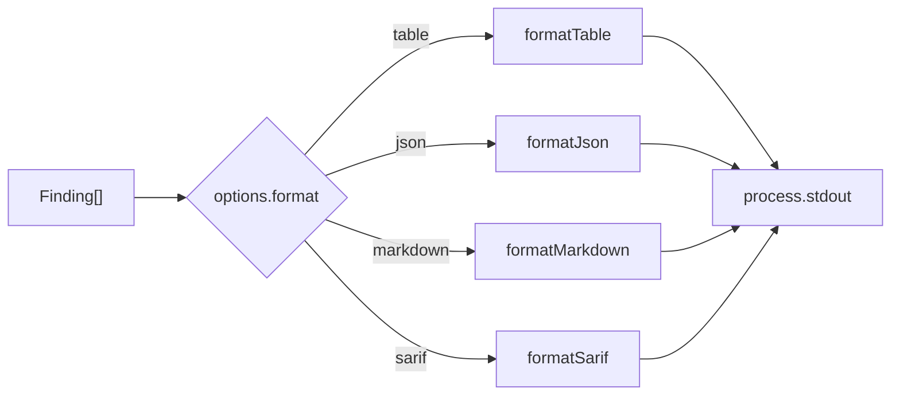
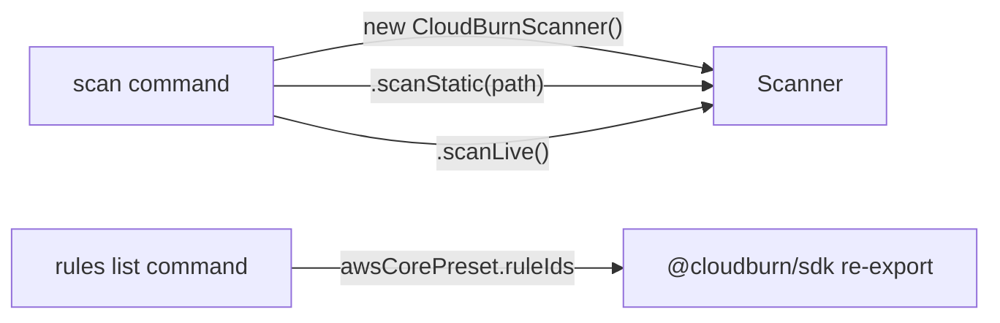

# CLI Architecture (`packages/cloudburn`)

## Command Tree

## Formatter Pipeline

All formatters share the signature `(findings: Finding[]) => string`.

| Formatter        | Output                                                       |
| ---------------- | ------------------------------------------------------------ |
| `formatTable`    | Plain space-separated lines: `ruleId resourceId message`     |
| `formatJson`     | Pretty JSON: `{ "findings": [...] }`                         |
| `formatMarkdown` | GitHub-flavored markdown table under `## CloudBurn Findings` |
| `formatSarif`    | SARIF 2.1.0 JSON, all results at `level: 'warning'`          |

## SDK Integration Points

- `scan` command creates a `CloudBurnScanner` instance and calls `.scanStatic(path)` or `.scanLive()` based on the `--live` flag.
- `rules list` imports `awsCorePreset` (re-exported from SDK) and prints `.ruleIds`.
- `init` and `estimate` have no SDK dependency (init prints hardcoded YAML, estimate is a stub).

## Exit-Code Contract

Defined in `src/exit-codes.ts`:

| Constant                     | Value | Meaning                                           |
| ---------------------------- | ----- | ------------------------------------------------- |
| `EXIT_CODE_OK`               | `0`   | Clean run, no findings (or `--exit-code` not set) |
| `EXIT_CODE_POLICY_VIOLATION` | `1`   | Findings exist AND `--exit-code` flag was passed  |
| `EXIT_CODE_RUNTIME_ERROR`    | `2`   | Reserved for runtime failures (not yet wired)     |

Only the `scan` command sets `process.exitCode`. All other commands exit `0` by default.
