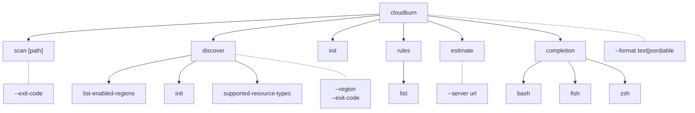
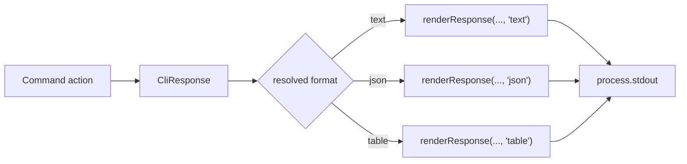

# CLI Architecture (`packages/cloudburn`)

## Command Tree



## Formatter Pipeline



All stdout-producing commands return a typed `CliResponse` and share the same format resolver.

| Format  | Output                                                                                                                             |
| ------- | ---------------------------------------------------------------------------------------------------------------------------------- |
| `json`  | Pretty JSON for the underlying response payload                                                                                    |
| `text`  | Tab-delimited rows for list-like output, or raw human-readable text for status/document output                                     |
| `table` | ASCII tables for scans, record lists, string lists, and key/value status output, except `rules list`, which uses a grouped outline |

## Command Behavior

- `scan [path]` is static IaC only. It accepts a Terraform file, CloudFormation template, or directory and calls `CloudBurnClient.scanStatic(path)`.
- `discover` runs live AWS discovery and rule evaluation through `CloudBurnClient.discover({ target })`.
- `discover --region all` requires a Resource Explorer aggregator index.
- `discover --region <region>` targets one enabled Resource Explorer index region.
- `discover list-enabled-regions` and `discover supported-resource-types` use the shared `text|json|table` renderer.
- `discover init` bootstraps Resource Explorer through the SDK and renders a status response through the shared formatter system.
- `rules list` renders built-in rule metadata grouped by provider and service for human-readable output and emits flat rule metadata objects in JSON mode.
- `init`, `rules list`, and `estimate` also use the shared formatter system instead of ad hoc string output.
- `completion` is a structural parent command. `completion bash|fish|zsh` prints shell completion scripts for the selected shell.
- `--format` is documented as a global option and defaults to `table`, except `init`, which preserves raw YAML text by default for redirection workflows, and `rules list`, which defaults to grouped text output.
- The hidden `__complete` command exists only as the runtime hook for generated shell scripts.
- `--exit-code` counts nested matches across all provider and rule groups.
- Runtime errors still write a structured JSON envelope to `stderr`.
- Root help configuration is shared through `src/help.ts`. New structural parent commands should register through `registerParentCommand(...)` so bare parent invocations print scoped help and future commands inherit the same help layout automatically.

### Help Examples

```text
cloudburn scan ./main.tf
cloudburn scan ./template.yaml
cloudburn scan ./iac
cloudburn discover
cloudburn discover --region eu-central-1
cloudburn discover --region all
cloudburn discover list-enabled-regions
cloudburn discover init
cloudburn rules
cloudburn rules list
cloudburn completion
cloudburn completion zsh
cloudburn --format json scan ./iac
```

## Exit-Code Contract

| Constant                     | Value | Meaning                                                         |
| ---------------------------- | ----- | --------------------------------------------------------------- |
| `EXIT_CODE_OK`               | `0`   | Clean run, no findings, or `--exit-code` not set                |
| `EXIT_CODE_POLICY_VIOLATION` | `1`   | At least one nested finding exists and `--exit-code` was passed |
| `EXIT_CODE_RUNTIME_ERROR`    | `2`   | Reserved for runtime failures                                   |
