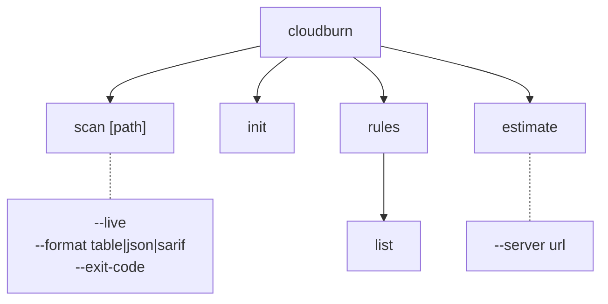
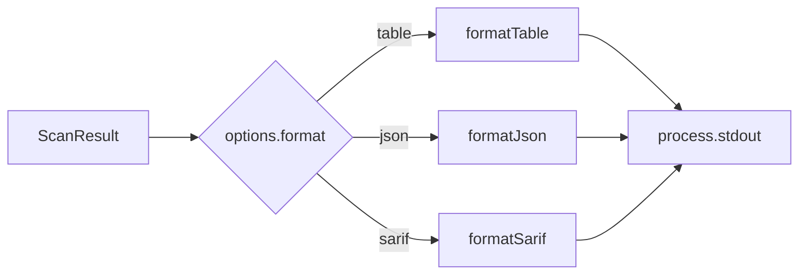

# CLI Architecture (`packages/cloudburn`)

## Command Tree



## Formatter Pipeline



All formatters now share the signature `(result: ScanResult) => string`.

| Formatter        | Output |
| ---------------- | ------ |
| `formatJson`     | Pretty JSON preserving the lean `providers -> rules -> findings` contract |
| `formatTable`    | One flattened line per nested match: `provider ruleId source service resourceId [location] message` using rule-group metadata plus nested finding data |
| `formatSarif`    | SARIF 2.1.0 JSON flattened from nested matches |

## Scan Command Behavior

- `scan --live` calls `CloudBurnScanner.scanLive()`.
- `scan [path]` accepts a Terraform file, CloudFormation template, or directory and calls `CloudBurnScanner.scanStatic(path)`.
- Static path parsing is auto-detected by the SDK parser layer; the CLI does not expose an IaC-type flag.
- The selected formatter receives the full grouped `ScanResult`.
- `--exit-code` counts nested matches across all provider and rule groups.

### Scan Help Examples

```text
cloudburn scan ./main.tf
cloudburn scan ./template.yaml
cloudburn scan ./iac
cloudburn scan --live
```

## Exit-Code Contract

| Constant                     | Value | Meaning |
| ---------------------------- | ----- | ------- |
| `EXIT_CODE_OK`               | `0`   | Clean run, no findings, or `--exit-code` not set |
| `EXIT_CODE_POLICY_VIOLATION` | `1`   | At least one nested finding exists and `--exit-code` was passed |
| `EXIT_CODE_RUNTIME_ERROR`    | `2`   | Reserved for runtime failures |
