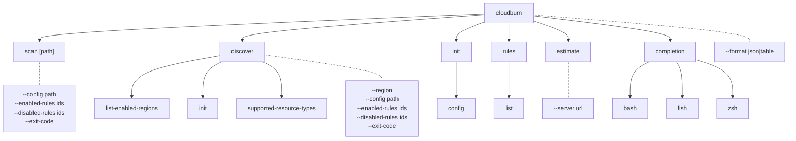
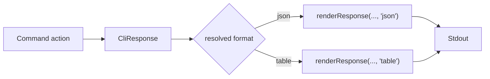

# CLI Architecture (`packages/cloudburn`)

## Command Tree



## Formatter Pipeline



All stdout-producing commands return a typed `CliResponse` and share the same format resolver.

| Format  | Output                                                                                                                             |
| ------- | ---------------------------------------------------------------------------------------------------------------------------------- |
| `json`  | Pretty JSON for the underlying response payload |
| `table` | ASCII tables for scans, record lists, string lists, key/value status output, and `rules list` |

## Command Behavior

- `scan [path]` is static IaC only. It accepts a Terraform file, CloudFormation template, or directory and calls `CloudBurnClient.scanStatic(path, config?, { configPath? })`.
- `scan` accepts `--config`, `--enabled-rules`, `--disabled-rules`, and `--service` as one-off overrides on top of the config file defaults.
- `discover` runs live AWS discovery and rule evaluation through `CloudBurnClient.discover({ target, config?, configPath? })`.
- `discover` accepts `--config`, `--enabled-rules`, `--disabled-rules`, and `--service` for one-off overrides of discovery config.
- `discover --region <region>` overrides the current AWS region resolved from `AWS_REGION`, `AWS_DEFAULT_REGION`, `aws_region`, then the AWS SDK region provider chain.
- `discover --region all` requires a Resource Explorer aggregator index.
- `discover --region <region>` targets one enabled Resource Explorer index region.
- `discover list-enabled-regions` and `discover supported-resource-types` use the shared `json|table` renderer.
- `discover init` bootstraps Resource Explorer through the SDK, defaults to the current AWS region, accepts `--region <region>` as an override, and falls back to local-only setup when cross-region bootstrap is denied.
- `discover init` status output includes the resolved setup `indexType` so users can distinguish local-only setup from aggregator setup.
- `rules list` defaults to a table of built-in rule metadata, accepts `--service` and `--source` filters, and emits flat rule metadata objects in JSON mode.
- `init` preserves the legacy starter-YAML output for backward compatibility when no format override is provided.
- `init config` creates `.cloudburn.yml`, while `init config --print` preserves raw YAML by default and can render table or JSON when `--format` is provided.
- `rules list`, `init config`, and `estimate` all use the shared formatter system instead of ad hoc string output.
- `completion` is a structural parent command. `completion bash|fish|zsh` prints shell completion scripts for the selected shell.
- `--format` is documented as a global option and defaults to `table`, except `init` / `init config --print`, which preserve raw YAML by default for redirection workflows.
- `scan` and `discover` can also source their default format from `.cloudburn.yml`; explicit `--format` still wins.
- The hidden `__complete` command exists only as the runtime hook for generated shell scripts.
- `--exit-code` counts nested matches across all provider and rule groups.
- Runtime errors still write a structured JSON envelope to `stderr`.
- Root help configuration is shared through `src/help.ts`. New structural parent commands should register through `registerParentCommand(...)` so bare parent invocations print scoped help and future commands inherit the same help layout automatically.

### Help Examples

```text
cloudburn scan ./main.tf
cloudburn scan ./template.yaml
cloudburn scan ./iac
cloudburn scan ./iac --config .cloudburn.yml
cloudburn scan ./iac --enabled-rules CLDBRN-AWS-EBS-1,CLDBRN-AWS-EC2-1
cloudburn scan ./iac --service ec2,s3
cloudburn discover
cloudburn discover --region eu-central-1
cloudburn discover --region all
cloudburn discover --config .cloudburn.yml --disabled-rules CLDBRN-AWS-S3-1
cloudburn discover --service ec2,s3
cloudburn discover list-enabled-regions
cloudburn discover init
cloudburn init
cloudburn init config
cloudburn init config --print
cloudburn rules
cloudburn rules list
cloudburn rules list --service ec2 --source discovery
cloudburn completion
cloudburn completion zsh
cloudburn --format json scan ./iac
```

## Exit-Code Contract

| Constant                     | Value | Meaning                                                         |
| ---------------------------- | ----- | --------------------------------------------------------------- |
| `EXIT_CODE_OK`               | `0`   | Clean run, no findings, or `--exit-code` not set                |
| `EXIT_CODE_POLICY_VIOLATION` | `1`   | At least one nested finding exists and `--exit-code` was passed |
| `EXIT_CODE_RUNTIME_ERROR`    | `2`   | Reserved for runtime failures                                   |
