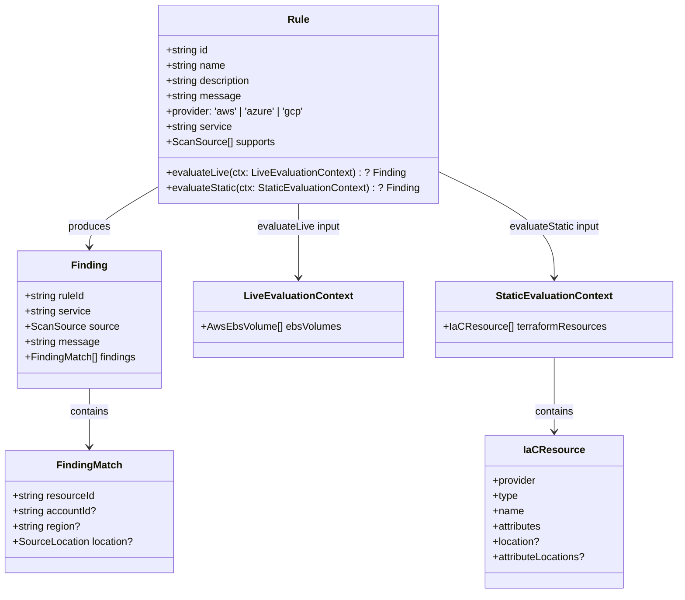
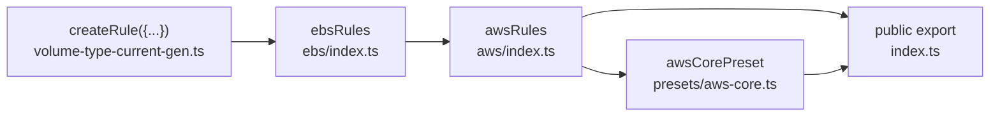

# Rules Architecture (`packages/rules`)

## Type Hierarchy

Rules now return a single grouped `Finding` or `null`. The SDK is responsible for regrouping those rule findings under providers in the public `ScanResult`.

## Rule Assembly Chain

## Authoring Rules

1. Use `createRule({ ... })`.
2. Keep the stable rule metadata, including the canonical public `message`, on the `Rule` object itself.
3. Build lean resource-level `FindingMatch` values inside the evaluator.
4. Return `{ ruleId, service, source, message, findings }` when there are matches.
5. Return `null` when nothing matches.

## ID Convention

- **Rule ID:** `CLDBRN-{PROVIDER}-{SERVICE}-{N}`
- Rule IDs remain stable and drive presets, configuration, and public scan output.
- There are no per-resource finding IDs in the public rules contract anymore.

## Current Rules

| ID                    | Name                                      | Service | Supports       | Status      |
| --------------------- | ----------------------------------------- | ------- | -------------- | ----------- |
| `CLDBRN-AWS-EC2-1`    | EC2 Instance Type Not in Allowed Profile  | ec2     | iac, discovery | Scaffold    |
| `CLDBRN-AWS-EBS-1`    | EBS Volume Type Not Current Generation    | ebs     | discovery, iac | Implemented |
| `CLDBRN-AWS-RDS-1`    | RDS Instance Class Not in Allowed Profile | rds     | iac, discovery | Scaffold    |
| `CLDBRN-AWS-S3-1`     | S3 Missing Lifecycle Configuration        | s3      | iac, discovery | Scaffold    |
| `CLDBRN-AWS-LAMBDA-1` | Lambda Cost Optimal Architecture          | lambda  | iac, discovery | Scaffold    |
