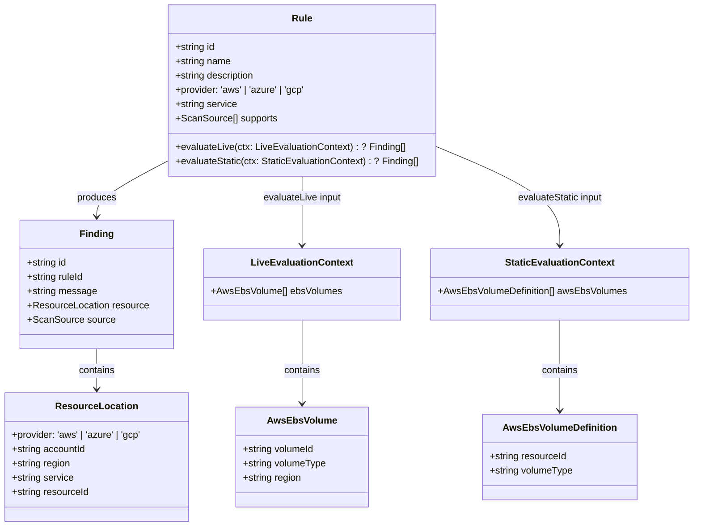
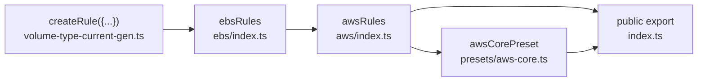

# Rules Architecture (`packages/rules`)

## Type Hierarchy

`ScanSource` is a string union: `'discovery' | 'iac'`.

## Rule Assembly Chain

### Step by step

1. **Rule file** — declares a single rule using `createRule({ id, name, description, provider, service, supports, evaluateLive?, evaluateStatic? })`.
2. **Service index** (e.g. `aws/ebs/index.ts`) — aggregates rules for one service: `export const ebsRules = [ebsVolumeTypeCurrentGenRule]`.
3. **Provider index** (`aws/index.ts`) — spreads all service arrays: `export const awsRules = [...ec2Rules, ...ebsRules, ...rdsRules, ...s3Rules, ...lambdaRules]`.
4. **Preset** (`presets/aws-core.ts`) — maps provider rules to IDs: `{ id: 'aws-core', ruleIds: toRuleIds(awsRules) }`.
5. **Public export** (`index.ts`) — re-exports `awsRules`, `awsCorePreset`, `createRule`, `toRuleIds`, and all types.

## ID Convention

- **Rule ID:** `CLDBRN-{PROVIDER}-{SERVICE}-{N}` — all uppercase, no zero-padding.
  - Examples: `CLDBRN-AWS-EBS-1`, `CLDBRN-AWS-EC2-1`, `CLDBRN-AWS-LAMBDA-1`
- **Finding ID:** `{ruleId}:{resourceId}`
  - Live example: `CLDBRN-AWS-EBS-1:vol-0abc123`
  - IaC example: `CLDBRN-AWS-EBS-1:aws_ebs_volume.gp2_data`
- **No-renumbering policy:** IDs are stable. Gaps are allowed when rules are removed.

## Current Rules

| ID                    | Name                                      | Service | Supports       | Status      |
| --------------------- | ----------------------------------------- | ------- | -------------- | ----------- |
| `CLDBRN-AWS-EC2-1`    | EC2 Instance Type Not in Allowed Profile  | ec2     | iac, discovery | Scaffold    |
| `CLDBRN-AWS-EBS-1`    | EBS Volume Type Not Current Generation    | ebs     | discovery, iac | Implemented |
| `CLDBRN-AWS-RDS-1`    | RDS Instance Class Not in Allowed Profile | rds     | iac, discovery | Scaffold    |
| `CLDBRN-AWS-S3-1`     | S3 Missing Lifecycle Configuration        | s3      | iac, discovery | Scaffold    |
| `CLDBRN-AWS-LAMBDA-1` | Lambda Cost Optimal Architecture          | lambda  | iac, discovery | Scaffold    |
