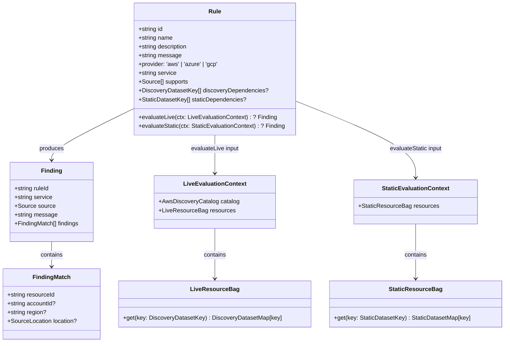
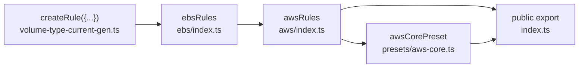

# Rules Architecture (`packages/rules`)

## Type Hierarchy

Rules return a single grouped `Finding` or `null`. The SDK regroups those rule findings under providers in the public `ScanResult`.

## Rule Assembly Chain

## Authoring Rules

See [`docs/guides/adding-a-rule.md`](../guides/adding-a-rule.md) for the full end-to-end guide and [`docs/reference/rule-ids.md`](../reference/rule-ids.md) for the ID convention and complete rule table.

## Current Rules

See [`docs/reference/rule-ids.md`](../reference/rule-ids.md) for the complete rule table with descriptions and support modes.
