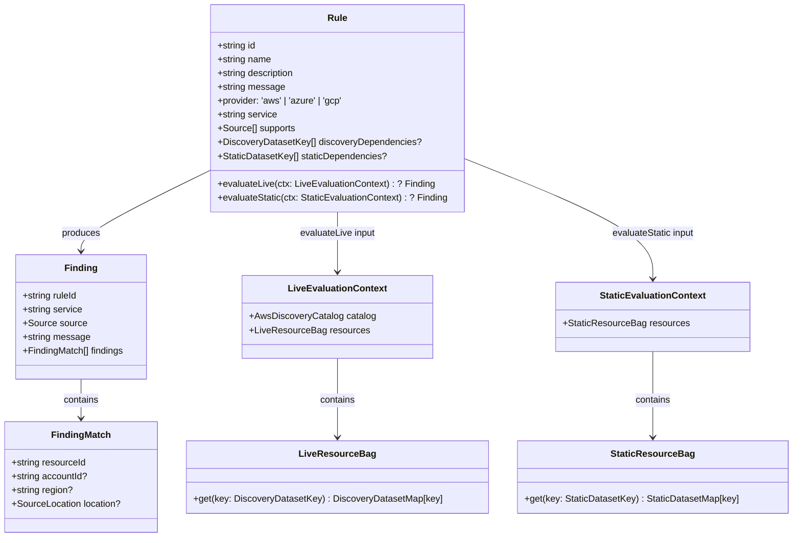
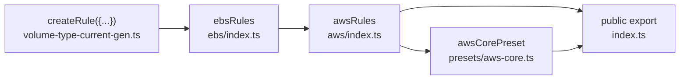

# Rules Architecture (`packages/rules`)

## Type Hierarchy

Rules now return a single grouped `Finding` or `null`. The SDK is responsible for regrouping those rule findings under providers in the public `ScanResult`.

## Rule Assembly Chain

## Authoring Rules

1. Use `createRule({ ... })`.
2. Keep the stable rule metadata, including the canonical public `message`, on the `Rule` object itself.
3. For static IaC rules, declare `staticDependencies` dataset keys.
4. For live AWS rules, declare `discoveryDependencies` dataset keys.
5. Build lean resource-level `FindingMatch` values inside the evaluator.
6. Return `{ ruleId, service, source, message, findings }` when there are matches.
7. Return `null` when nothing matches.

Rule evaluators consume static and live datasets through `context.resources.get('<dataset-key>')`. Rules should not declare Terraform resource type strings, CloudFormation type strings, Resource Explorer `resourceTypes`, or loader wiring directly.

## ID Convention

- **Rule ID:** `CLDBRN-{PROVIDER}-{SERVICE}-{N}`
- Rule IDs remain stable and drive presets, configuration, and public scan output.
- There are no per-resource finding IDs in the public rules contract anymore.

## Current Rules

| ID                        | Name                                       | Service    | Supports       | Status      |
| ------------------------- | ------------------------------------------ | ---------- | -------------- | ----------- |
| `CLDBRN-AWS-CLOUDTRAIL-1` | CloudTrail Redundant Global Trails         | cloudtrail | discovery      | Implemented |
| `CLDBRN-AWS-CLOUDTRAIL-2` | CloudTrail Redundant Regional Trails       | cloudtrail | discovery      | Implemented |
| `CLDBRN-AWS-CLOUDWATCH-1` | CloudWatch Log Group Missing Retention     | cloudwatch | discovery      | Implemented |
| `CLDBRN-AWS-CLOUDWATCH-2` | CloudWatch Unused Log Streams              | cloudwatch | discovery      | Implemented |
| `CLDBRN-AWS-EC2-1`        | EC2 Instance Type Not Preferred            | ec2        | iac, discovery | Implemented |
| `CLDBRN-AWS-EC2-2`        | S3 Interface VPC Endpoint Used             | ec2        | iac            | Implemented |
| `CLDBRN-AWS-EC2-3`        | Elastic IP Address Unassociated            | ec2        | discovery      | Implemented |
| `CLDBRN-AWS-EC2-4`        | VPC Interface Endpoint Inactive            | ec2        | discovery      | Implemented |
| `CLDBRN-AWS-EC2-5`        | EC2 Instance Low Utilization               | ec2        | discovery      | Implemented |
| `CLDBRN-AWS-EC2-10`       | NAT Gateway Idle                           | ec2        | discovery      | Implemented |
| `CLDBRN-AWS-EBS-1`        | EBS Volume Type Not Current Generation     | ebs        | discovery, iac | Implemented |
| `CLDBRN-AWS-EBS-2`        | EBS Volume Unattached                      | ebs        | discovery      | Implemented |
| `CLDBRN-AWS-EBS-3`        | EBS Volume Attached To Stopped Instances   | ebs        | discovery      | Implemented |
| `CLDBRN-AWS-EBS-4`        | EBS Volume Large Size                      | ebs        | discovery      | Implemented |
| `CLDBRN-AWS-EBS-5`        | EBS Volume High Provisioned IOPS           | ebs        | discovery      | Implemented |
| `CLDBRN-AWS-EBS-6`        | EBS Volume Low Provisioned IOPS On io1/io2 | ebs        | discovery      | Implemented |
| `CLDBRN-AWS-EBS-7`        | EBS Snapshot Max Age Exceeded              | ebs        | discovery      | Implemented |
| `CLDBRN-AWS-ECR-1`        | ECR Repository Missing Lifecycle Policy    | ecr        | iac, discovery | Implemented |
| `CLDBRN-AWS-RDS-1`        | RDS Instance Class Not Preferred           | rds        | iac, discovery | Implemented |
| `CLDBRN-AWS-RDS-2`        | RDS DB Instance Idle                       | rds        | discovery      | Implemented |
| `CLDBRN-AWS-S3-1`         | S3 Missing Lifecycle Configuration         | s3         | iac, discovery | Implemented |
| `CLDBRN-AWS-S3-2`         | S3 Bucket Storage Class Not Optimized      | s3         | iac, discovery | Implemented |
| `CLDBRN-AWS-SAGEMAKER-1`  | SageMaker Notebook Instance Running        | sagemaker  | discovery      | Implemented |
| `CLDBRN-AWS-LAMBDA-1`     | Lambda Cost Optimal Architecture           | lambda     | iac, discovery | Implemented |

`CLDBRN-AWS-LAMBDA-1` is an advisory rule. It recommends `arm64` only when compatibility is known or explicitly declared, and the static evaluator skips computed or otherwise unknown architecture values instead of treating them as definite `x86_64`.

CloudTrail and CloudWatch discovery rules now rely on dedicated live datasets. CloudBurn seeds both CloudWatch datasets from Resource Explorer `logs:log-group` catalog results, then uses narrow CloudWatch Logs APIs to hydrate group retention metadata and enumerate log streams.

EBS discovery rules now reuse the shared `aws-ebs-volumes` dataset for storage type, attachment, size, and IOPS checks, and use a dedicated `aws-ebs-snapshots` dataset seeded from Resource Explorer `ec2:snapshot` resources for snapshot-age review.

NAT gateway and SageMaker notebook discovery follow the same catalog-first model: CloudBurn seeds NAT review from `ec2:natgateway` resources and hydrates 7-day traffic totals with `DescribeNatGateways` plus CloudWatch metrics, while SageMaker notebook review is seeded from `sagemaker:notebook-instance` resources and hydrated through `DescribeNotebookInstance`.
