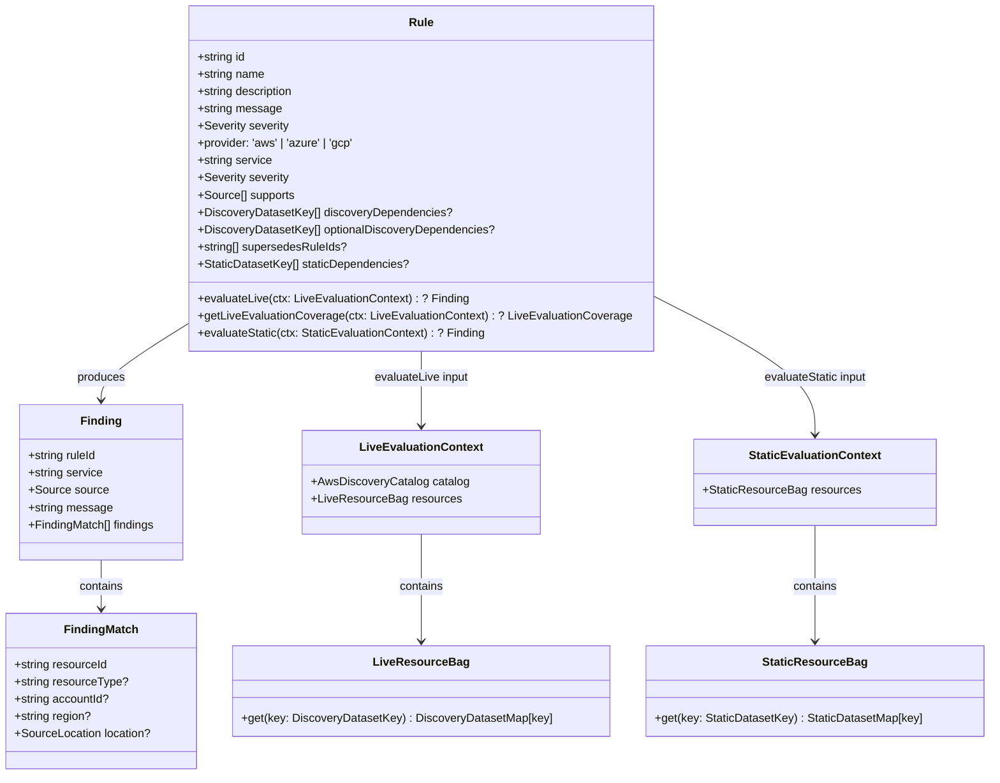
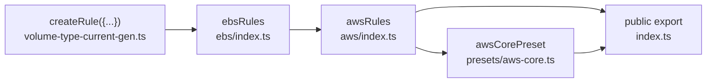

# Rules Architecture (`packages/rules`)

## Type Hierarchy

```mermaid
classDiagram
  class Rule {
    +string id
    +string name
    +string description
    +string message
    +Severity severity
    +provider: 'aws' | 'azure' | 'gcp'
    +string service
    +Severity severity
    +Source[] supports
    +DiscoveryDatasetKey[] discoveryDependencies?
    +DiscoveryDatasetKey[] optionalDiscoveryDependencies?
    +string[] supersedesRuleIds?
    +StaticDatasetKey[] staticDependencies?
    +evaluateLive(ctx: LiveEvaluationContext)? Finding
    +getLiveEvaluationCoverage(ctx: LiveEvaluationContext)? LiveEvaluationCoverage
    +evaluateStatic(ctx: StaticEvaluationContext)? Finding
  }

  class Finding {
    +string ruleId
    +string service
    +Source source
    +string message
    +FindingMatch[] findings
  }

  class FindingMatch {
    +string resourceId
    +string resourceType?
    +string accountId?
    +string region?
    +SourceLocation location?
  }

  class LiveEvaluationContext {
    +AwsDiscoveryCatalog catalog
    +LiveResourceBag resources
  }

  class LiveResourceBag {
    +get(key: DiscoveryDatasetKey) DiscoveryDatasetMap[key]
  }

  class StaticResourceBag {
    +get(key: StaticDatasetKey) StaticDatasetMap[key]
  }

  class StaticEvaluationContext {
    +StaticResourceBag resources
  }

  Rule --> Finding : produces
  Finding --> FindingMatch : contains
  Rule --> LiveEvaluationContext : evaluateLive input
  LiveEvaluationContext --> LiveResourceBag : contains
  Rule --> StaticEvaluationContext : evaluateStatic input
  StaticEvaluationContext --> StaticResourceBag : contains
```

Rules return a single grouped `Finding` or `null`. The SDK regroups those rule findings under providers in the public `ScanResult`.

Live rules can also implement `getLiveEvaluationCoverage(context)` to return `assessed` and `unknown` resource
identities without changing the evaluator's return shape. `assessed` includes both findings and known non-findings;
`unknown` means required evidence is unavailable or incomplete. Use the same identity as the rule's findings, and
include the inventory dataset in `discoveryDependencies` when missing metric rows would otherwise hide resources.
The pure `createLiveEvaluationCoverage` helper partitions an inventory with a rule-specific assessment predicate.

All built-in CloudWatch metric rules report this coverage, as do the ECR lifecycle-content rules and the Compute
Optimizer Lambda memory rule. ECR repositories with a lifecycle policy whose traits could not be parsed stay unknown,
while repositories without a policy remain assessed. Lambda functions are assessed only when the memory
recommendation dataset carries a `memory_overprovisioned` or `not_overprovisioned` assessment for their ARN; absent or
`unavailable` assessments stay unknown. Each rule checks its own required normalized metrics, so
unknown Lambda errors do not prevent duration assessment. A resource that is outside a rule's policy remains
assessed without metric evidence. EC2's low-utilization rule can establish a finding from four observed idle days;
a non-finding requires all 14 observed days. The additive `observedDays` field records that count; legacy custom
EC2 loaders that omit it can still establish findings, but cannot establish a complete non-finding.

Unknown AWS Config recording metrics retain their candidate identities with `null` recorded-item counts and saving
estimates. Custom consumers of `AwsConfigRecordingFrequencyReview` must check these nullable fields before using
them in calculations. The SDK exposes the rule's coverage and reports `unknown` rather than a passed evaluation when
required evidence is missing and no findings were established.

Rules with stronger evidence can declare `supersedesRuleIds`. The live engine removes only findings with the same
resource namespace, ID, account, and Region, and only when the superseding rule is active and emits that identity.
Evaluation records retain each evaluator's original result, including findings later omitted from provider output by
precedence.

## Rule Assembly Chain

```mermaid
graph LR
  RuleFile["createRule({...})\nvolume-type-current-gen.ts"] --> ServiceIdx["ebsRules\nebs/index.ts"]
  ServiceIdx --> ProviderIdx["awsRules\naws/index.ts"]
  ProviderIdx --> Preset["awsCorePreset\npresets/aws-core.ts"]
  ProviderIdx --> Export["public export\nindex.ts"]
  Preset --> Export
```

`awsRules` is the complete public AWS rule pack. `awsCorePreset` is the runtime default and may exclude opt-in rules whose infrastructure requirements are not guaranteed by a standard setup.

## Authoring Rules

See [`docs/guides/adding-a-rule.md`](../guides/adding-a-rule.md) for the full end-to-end guide and [`docs/reference/rule-ids.md`](../reference/rule-ids.md) for the ID convention and complete rule table.

## Current Rules

See [`docs/reference/rule-ids.md`](../reference/rule-ids.md) for the complete rule table with descriptions and support modes.

AWS evidence joins use the full resource identity. Service-local identifiers such as Redshift cluster names and EMR cluster IDs are scoped by account and region before matching metrics.

Load-balancer rules build one target-group ARN index per evaluation. An unknown target group never counts as empty.
