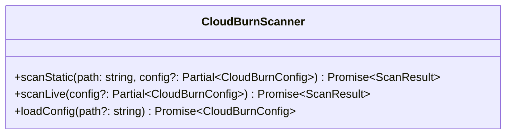
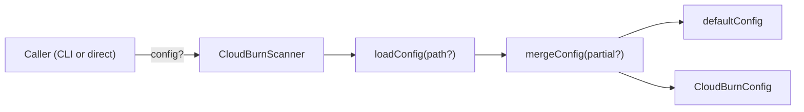
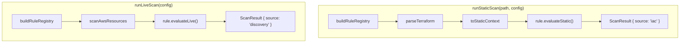
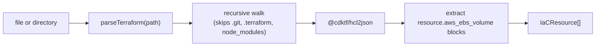
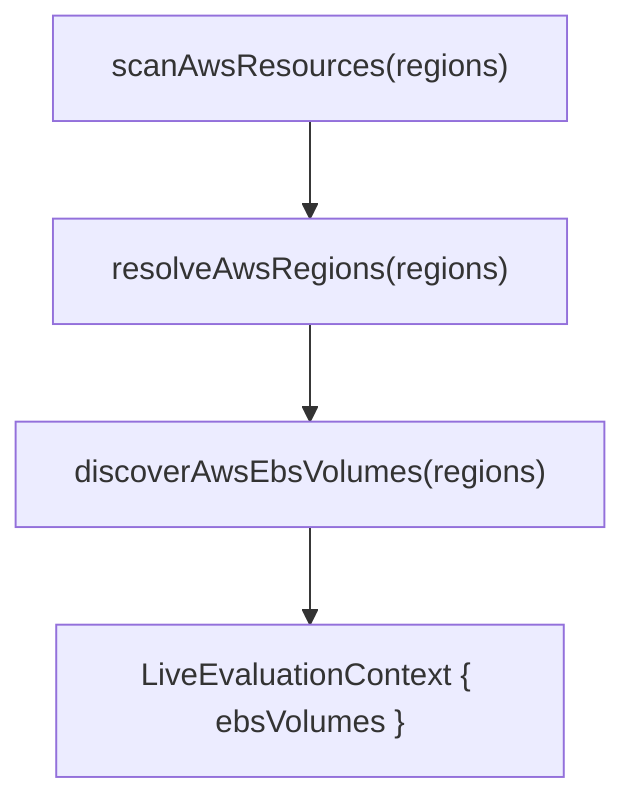

# SDK Architecture (`packages/sdk`)

## CloudBurnScanner Facade

The facade is the only public entry point. It delegates to the config system and engine functions.

## Config Pipeline

- `loadConfig(path?)` — currently returns `mergeConfig()` (pure defaults). YAML file reading is a TODO.
- `mergeConfig(partial?)` — deep-spreads caller overrides into `defaultConfig`. Explicit sub-object merging for `profiles`, `rules`, `live` (including `live.tags`, `live.regions`).
- `defaultConfig` — baseline: `{ version: 1, profile: 'dev', profiles: {}, rules: {}, customRules: [], live: { tags: {}, regions: [] } }`.
- `CLOUDBURN_CONFIG_VERSION` — currently `1` (from `schema.ts`).

## Engine

### Rule Registry (`engine/registry.ts`)

`buildRuleRegistry(config)` assembles the active rule set. Currently returns all `awsRules` from `@cloudburn/rules` unconditionally — enable/disable filtering and custom rule loading are TODOs.

### Static Scan (`engine/run-static.ts`)

1. Build rule registry
2. `parseTerraform(path)` — parse `.tf` files into `IaCResource[]`
3. `toStaticContext(resources)` — maps `IaCResource[]` to `StaticEvaluationContext` (currently handles `aws_ebs_volume` only)
4. Filter rules to those with `supports.includes('iac')` and `evaluateStatic` defined
5. Invoke each rule's `evaluateStatic(context)`, collect findings

### Live Scan (`engine/run-live.ts`)

1. Build rule registry
2. `scanAwsResources(regions)` — discover live AWS resources into `LiveEvaluationContext`
3. Filter rules to those with `supports.includes('discovery')` and `evaluateLive` defined
4. Invoke each rule's `evaluateLive(context)`, collect findings

## Parser Layer

`IaCResource` shape: `{ provider, service, type, name, attributes }`.

Currently only `aws_ebs_volume` resources are extracted. A CloudFormation parser (`parseCloudFormation`) is re-exported but not yet implemented.

## AWS Provider Layer

| Discoverer               | Status                                               |
| ------------------------ | ---------------------------------------------------- |
| `discoverAwsEbsVolumes`  | Implemented — paginates `DescribeVolumes` per region |
| `discoverEc2Resources`   | Stub (returns `[]`)                                  |
| `discoverRdsResources`   | Stub (returns `[]`)                                  |
| `discoverS3Resources`    | Stub (returns `[]`)                                  |
| `discoverElbV2Resources` | Stub (returns `[]`)                                  |
| `fetchCloudWatchSignals` | Stub (returns `[]`)                                  |

`resolveAwsRegions` auto-detects the current region via the EC2 client if no regions are configured.
