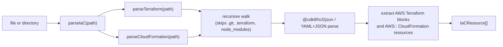

# SDK Architecture (`packages/sdk`)

## CloudBurnClient Facade

```mermaid
  classDiagram
  class CloudBurnClient {
    +scanStatic(path: string, config?: Partial~CloudBurnConfig~) Promise~ScanResult~
    +discover(options?: { target?: AwsDiscoveryTarget, config?: Partial~CloudBurnConfig~ }) Promise~ScanResult~
    +listEnabledDiscoveryRegions() Promise~AwsDiscoveryRegion[]~
    +initializeDiscovery(options?: { region?: string }) Promise~AwsDiscoveryInitialization~
    +listSupportedDiscoveryResourceTypes() Promise~AwsSupportedResourceType[]~
    +loadConfig(path?: string) Promise~CloudBurnConfig~
  }
```

`CloudBurnClient` is the primary public entry point. Static IaC scans go through `scanStatic()`, and live AWS discovery goes through `discover()`.

## Engine Flow

```mermaid
graph TD
  subgraph Static["runStaticScan(path, config)"]
    SR[buildRuleRegistry] --> SP[parseIaC]
    SP --> SC[toStaticContext]
    SC --> SE["rule.evaluateStatic() => Finding | null"]
    SE --> SG[groupFindingsByProvider]
    SG --> SOut["ScanResult { providers: ProviderFindingGroup[] }"]
  end

  subgraph Live["runLiveScan(config, target)"]
    LR[buildRuleRegistry] --> LT[collect discovery requirements]
    LT --> LC[buildAwsDiscoveryCatalog]
    LC --> LH[hydrate matched resources]
    LH --> LX[build LiveEvaluationContext]
    LX --> LE["rule.evaluateLive() => Finding | null"]
    LE --> LG[groupFindingsByProvider]
    LG --> LOut["ScanResult { providers: ProviderFindingGroup[] }"]
  end
```



### Static Scan

1. Build the rule registry.
2. Auto-detect Terraform and CloudFormation inputs and parse them into normalized `IaCResource[]`.
3. Build `StaticEvaluationContext` with `iacResources`.
4. Invoke each static evaluator.
5. Group non-null rule findings under `providers -> rules -> findings`.

### Live Scan

1. Build the rule registry.
2. Collect unique Resource Explorer `resourceTypes` from active discovery rules.
3. Build one AWS discovery catalog through Resource Explorer filter-only list queries.
4. Hydrate only the matched resources that active rules need extra fields for.
5. Build `LiveEvaluationContext`.
6. Invoke each live evaluator.
7. Group non-null rule findings under `providers -> rules -> findings`.

Current live-discovery behavior:

- `discover` is the live entrypoint for both the CLI and direct SDK callers.
- Default discovery target is the current region, resolved from `AWS_REGION`, then `AWS_DEFAULT_REGION`, then `aws_region`, then the AWS SDK region provider chain.
- `--region all` requires an aggregator index and fails fast when one is not enabled.
- Discovery resolves the explicit default Resource Explorer view in the chosen search region and fails if no default view exists or if that default view applies additional filters.
- Catalog collection uses Resource Explorer `ListResources` with filter strings instead of `Search`, which avoids the 1,000-result ceiling on filter-only queries.
- Resource Explorer inventory failures and hydrator failures are fatal. The SDK no longer degrades to partial live results.
- Missing Lambda `Architectures` values from AWS are normalized to `['x86_64']`, matching the AWS default architecture.
- Lambda hydrators limit in-flight `GetFunctionConfiguration` calls per region to avoid API throttling in large accounts.
- Live scans require Resource Explorer access plus narrow hydrator permissions such as `ec2:DescribeVolumes`, `ec2:DescribeInstances`, and `lambda:GetFunctionConfiguration`.

## Public Result Shape

```ts
type ScanResult = {
  providers: Array<{
    provider: 'aws' | 'azure' | 'gcp';
    rules: Array<{
      ruleId: string;
      service: string;
      source: ScanSource;
      message: string;
      findings: FindingMatch[];
    }>;
  }>;
};
```

- Empty scans return `{ providers: [] }`.
- `source`, `service`, and `message` are carried on each rule group, not on `ScanResult`.
- IaC matches may include `location`.

## Parser Layer



`parseIaC(path)` accepts a Terraform file, CloudFormation template, or directory. It aggregates both parsers, ignores unsupported files, and preserves stable ordering for mixed directories.

## Provider Layer

`buildRuleRegistry(config)` still decides which rules are active. Live AWS rules now also declare `liveDiscovery` metadata in `@cloudburn/rules`, which the SDK uses to:

- collect unique Resource Explorer `resourceTypes`
- decide which hydrators to invoke
- keep service-specific AWS calls out of the generic discovery path

The engines still use `rule.provider` to place each non-null rule finding into the correct top-level provider group in `ScanResult`.
