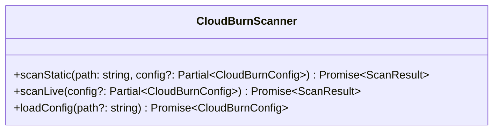
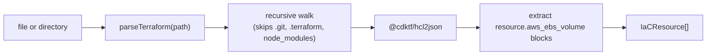

# SDK Architecture (`packages/sdk`)

## CloudBurnScanner Facade



The facade is the only public entry point. It delegates to config loading, resource discovery/parsing, rule evaluation, and provider grouping.

## Engine Flow

```mermaid
graph TD
  subgraph Static["runStaticScan(path, config)"]
    SR[buildRuleRegistry] --> SP[parseTerraform]
    SP --> SC[toStaticContext]
    SC --> SE["rule.evaluateStatic() => Finding | null"]
    SE --> SG[groupFindingsByProvider]
    SG --> SOut["ScanResult { providers: ProviderFindingGroup[] }"]
  end

  subgraph Live["runLiveScan(config)"]
    LR[buildRuleRegistry] --> LA[scanAwsResources]
    LA --> LE["rule.evaluateLive() => Finding | null"]
    LE --> LG[groupFindingsByProvider]
    LG --> LOut["ScanResult { providers: ProviderFindingGroup[] }"]
  end
```



### Static Scan

1. Build the rule registry.
2. Parse Terraform into normalized `IaCResource[]`.
3. Build `StaticEvaluationContext`.
4. Invoke each static evaluator.
5. Group non-null rule findings under `providers -> rules -> findings`.

### Live Scan

1. Build the rule registry.
2. Discover live AWS resources.
3. Build `LiveEvaluationContext`.
4. Invoke each live evaluator.
5. Group non-null rule findings under `providers -> rules -> findings`.

## Public Result Shape

```ts
type ScanResult = {
  providers: Array<{
    provider: 'aws' | 'azure' | 'gcp';
    rules: Array<{
      ruleId: string;
      service: string;
      source: ScanSource;
      message: string;
      findings: FindingMatch[];
    }>;
  }>;
};
```

- Empty scans return `{ providers: [] }`.
- `source`, `service`, and `message` are carried on each rule group, not on `ScanResult`.
- IaC matches may include `location`.

## Parser Layer



`IaCResource` now carries normalized attributes plus optional block- and attribute-level source locations for supported Terraform resources.

## Provider Layer

`buildRuleRegistry(config)` still decides which rules are active. The engines use `rule.provider` to place each non-null rule finding into the correct top-level provider group in `ScanResult`.
