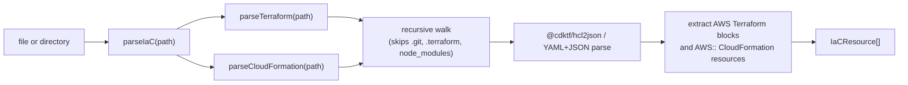

# SDK Architecture (`packages/sdk`)

## CloudBurnClient Facade

```mermaid
  classDiagram
  class CloudBurnClient {
    +scanStatic(path: string, config?: Partial~CloudBurnConfig~, options?: { configPath?: string }) Promise~ScanResult~
    +discover(options?: { target?: AwsDiscoveryTarget, config?: Partial~CloudBurnConfig~, configPath?: string }) Promise~ScanResult~
    +initializeDiscovery(options?: { region?: string }) Promise~AwsDiscoveryInitialization~
    +getDiscoveryStatus(options?: { region?: string }) Promise~AwsDiscoveryStatus~
    +listSupportedDiscoveryResourceTypes() Promise~AwsSupportedResourceType[]~
    +loadConfig(path?: string) Promise~CloudBurnConfig~
  }
```

`CloudBurnClient` is the primary public entry point. Static IaC scans go through `scanStatic()`, and live AWS discovery goes through `discover()`. Both methods can accept runtime config overrides plus an explicit `configPath` when callers need to load a specific `.cloudburn.yml` file.

## Engine Flow

```mermaid
graph TD
  subgraph Static["runStaticScan(path, config)"]
    SR[buildRuleRegistry] --> SD[collect staticDependencies]
    SD --> SRg[resolve static dataset registry entries]
    SRg --> SP[parseIaC(required sourceKinds)]
    SP --> SL[load required static datasets]
    SL --> SC[build StaticEvaluationContext]
    SC --> SE["rule.evaluateStatic() => Finding | null"]
    SE --> SG[groupFindingsByProvider]
    SG --> SOut["ScanResult { providers: ProviderFindingGroup[] }"]
  end

  subgraph Live["runLiveScan(config, target)"]
    LR[buildRuleRegistry] --> LD[collect discoveryDependencies]
    LD --> LRg[resolve dataset registry entries]
    LRg --> LC[buildAwsDiscoveryCatalog]
    LC --> LL[load required datasets]
    LL --> LX[build LiveEvaluationContext]
    LX --> LE["rule.evaluateLive() => Finding | null"]
    LE --> LG[groupFindingsByProvider]
    LG --> LOut["ScanResult { providers: ProviderFindingGroup[] }"]
  end
```

### Static Scan

1. Build the rule registry.
2. Collect unique `staticDependencies` from active static rules.
3. Resolve those dataset keys through the AWS static dataset registry.
4. Union required IaC source kinds from the resolved dataset definitions.
5. Parse only the required Terraform and CloudFormation inputs.
6. Load only the requested normalized static datasets.
7. Build `StaticEvaluationContext` with `{ resources: StaticResourceBag }`.
8. Invoke each static evaluator.
9. Group non-null rule findings under `providers -> rules -> findings`.

### Live Scan

1. Build the rule registry.
2. Collect unique `discoveryDependencies` from active discovery rules.
3. Resolve those dataset keys through the AWS discovery dataset registry.
4. Union required Resource Explorer `resourceTypes` from the resolved dataset definitions.
5. Build one AWS discovery catalog through Resource Explorer filter-only list queries.
6. Load only the required datasets (including hydrator-backed loaders when needed).
7. Build `LiveEvaluationContext` with `{ catalog, resources: LiveResourceBag }`.
8. Invoke each live evaluator.
9. Group non-null rule findings under `providers -> rules -> findings`.

Current live-discovery behavior:

- `discover` is the live entrypoint for both the CLI and direct SDK callers.
- `discoverAwsResources` in `src/providers/aws/discovery.ts` is the AWS live orchestration entrypoint.
- Default discovery target is the current region (see [`docs/architecture/cli.md`](cli.md) for the full resolution order).
- Explicit discovery uses `target: { mode: 'regions', regions: [...] }`.
- Explicit single-region discovery uses the selected region as the Resource Explorer control plane instead of the ambient current region.
- Explicit multi-region discovery requires an aggregator index and fails fast when one is not enabled.
- Discovery resolves the explicit default Resource Explorer view in the chosen search region and fails if no default view exists or if that default view applies additional filters.
- Discovery setup returns existing local indexes without forcing aggregator creation, and `discover init` retries as local-only setup when cross-region aggregator creation is denied.
- Catalog collection uses Resource Explorer `ListResources` with filter strings instead of `Search`, which avoids the 1,000-result ceiling on filter-only queries.
- Resource Explorer catalog seeding batches `resourcetype:` and `region:` filters into the smallest possible query set, raises `MaxResults` to `1000`, and retries throttled `ListResources` calls before failing.
- Account-scoped or fallback-backed datasets can bypass Resource Explorer seeding entirely by declaring no `resourceTypes`; the loader then receives `[]` and owns the account-level API call.
- Resource Explorer inventory failures and dataset loader failures are fatal. The SDK does not degrade to partial live results.
- Missing Lambda `Architectures` values from AWS are normalized to `['x86_64']`, matching the AWS default architecture.
- Lambda hydrators limit in-flight `GetFunctionConfiguration` calls per region to avoid API throttling in large accounts.
- Live scans require Resource Explorer access plus narrow hydrator permissions such as `apigateway:GetStage`, `application-autoscaling:DescribeScalableTargets`, `application-autoscaling:DescribeScalingPolicies`, `ce:GetCostAndUsage`, `cloudfront:GetDistribution`, `cloudfront:ListDistributions`, `cloudtrail:DescribeTrails`, `cloudwatch:GetMetricData`, `dynamodb:DescribeTable`, `ecs:DescribeContainerInstances`, `ecs:DescribeServices`, `ec2:DescribeInstances`, `ec2:DescribeNatGateways`, `ec2:DescribeVolumes`, `eks:ListNodegroups`, `eks:DescribeNodegroup`, `lambda:GetFunctionConfiguration`, `rds:DescribeDBInstances`, `route53:ListHealthChecks`, `route53:ListHostedZones`, `route53:ListResourceRecordSets`, `s3:GetLifecycleConfiguration`, `s3:GetIntelligentTieringConfiguration`, `sagemaker:DescribeEndpoint`, `sagemaker:DescribeEndpointConfig`, `sagemaker:DescribeNotebookInstance`, and `secretsmanager:DescribeSecret`.

## Public Result Shape

See [`docs/reference/finding-shape.md`](../reference/finding-shape.md) for the full `ScanResult`, `Finding`, and `FindingMatch` type contracts.

## Parser Layer



`parseIaC(path, { sourceKinds? })` accepts a Terraform file, CloudFormation template, or directory. It can limit parsing to the source kinds required by active static datasets, ignores unsupported files, and preserves stable ordering for mixed directories.

## Provider Layer

`buildRuleRegistry(config, mode)` decides which rules are active for the requested mode.

Config behavior: see [`docs/reference/config-schema.md`](../reference/config-schema.md) for full field definitions, merge behavior, and config loading semantics. Registry filtering is mode-aware and only activates rules that support the requested source.

Static AWS rules declare `staticDependencies` dataset keys in `@cloudburn/rules`, and the SDK static registry resolves each key into:

- required IaC `sourceKinds` (`terraform`, `cloudformation`)
- source-native resource type mapping owned by the SDK
- normalized dataset output exposed through `StaticResourceBag`

Live AWS rules declare `discoveryDependencies` dataset keys in `@cloudburn/rules`, and the SDK discovery registry resolves each key into:

- Resource Explorer `resourceTypes` needed to seed the dataset
- dataset loader behavior (projection-only or hydrator-backed)
- normalized dataset output exposed through `LiveResourceBag`

This keeps Terraform, CloudFormation, and Resource Explorer specifics out of rule files while allowing new static or live datasets without changing core orchestration flow.

The engines still use `rule.provider` to place each non-null rule finding into the correct top-level provider group in `ScanResult`.
