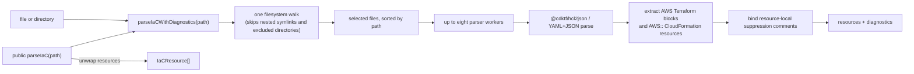

# SDK Architecture (`packages/sdk`)

## CloudBurnClient Facade

```mermaid
  classDiagram
  class CloudBurnClient {
    +scanStatic(path: string, config?: Partial~CloudBurnConfig~, options?: { configPath?: string }) Promise~ScanResult~
    +discover(options?: { target?: AwsDiscoveryTarget, config?: Partial~CloudBurnConfig~, configPath?: string, timeoutMs?: number, signal?: AbortSignal }) Promise~ScanResult~
    +initializeDiscovery(options?: { region?: string, timeoutMs?: number, signal?: AbortSignal }) Promise~AwsDiscoveryInitialization~
    +getDiscoveryStatus(options?: { region?: string, timeoutMs?: number, signal?: AbortSignal }) Promise~AwsDiscoveryStatus~
    +listSupportedDiscoveryResourceTypes(options?: AwsDiscoveryExecutionOptions) Promise~AwsSupportedResourceType[]~
    +loadConfig(path?: string) Promise~CloudBurnConfig~
  }
```

`CloudBurnClient` is the primary public entry point. Static IaC scans go through `scanStatic()` and live AWS scans go
through `discover()`. Applications select the rules that fit their use case with mode configuration and can request
generic evaluation evidence with `includeEvaluationResources`. The SDK owns rule execution, normalized findings,
generic rule metadata, and evaluated-resource projection; applications own product profiles and presentation policy.

`scanStatic()` and `discover()` can accept runtime config overrides plus an explicit `configPath`. When the effective
mode config sets `failOn`, the facade evaluates it after the engine returns and attaches the threshold, qualifying
count, and violation status to `ScanResult.policy`.

## Engine Flow

```mermaid
graph TD
  subgraph Static["runStaticScan(path, config)"]
    SR[buildRuleRegistry] --> SD[collect staticDependencies]
    SD --> SRg[resolve static dataset registry entries]
    SRg --> SP[parseIaCWithDiagnostics(required sourceKinds)]
    SP --> SL[load required static datasets and suppression targets]
    SL --> SC[build StaticEvaluationContext]
    SC --> SE["rule.evaluateStatic() => Finding | null"]
    SE --> SX[partition active and suppressed matches]
    SX --> SG[groupFindingsByProvider]
    SG --> SOut["ScanResult { providers, suppressed?, diagnostics? }"]
  end

  subgraph Live["runLiveScan(config, target, options)"]
    LR[buildRuleRegistry] --> LD[collect discoveryDependencies]
    LD --> LRg[resolve dataset registry entries]
    LRg --> LC[buildAwsDiscoveryCatalog]
    LC --> LL[load required datasets]
    LL --> LX[build LiveEvaluationContext]
    LX --> LE["rule.evaluateLive() => Finding | null"]
    LE --> LA{includeEvaluationResources?}
    LA -->|yes| LP[project normalized resources and rule status]
    LA -->|no| LG[groupFindingsByProvider]
    LP --> LG
    LG --> LOut["ScanResult { providers, evaluations? }"]
  end
```

### Static Scan

1. Build the rule registry.
2. Collect unique `staticDependencies` from active static rules.
3. Resolve those dataset keys through the AWS static dataset registry.
4. Union required IaC source kinds from the resolved dataset definitions.
5. Parse only the required Terraform and CloudFormation inputs through
   `parseIaCWithDiagnostics` and retain non-fatal skipped-file diagnostics.
6. Group Terraform resources by module directory and CloudFormation resources by template file. Load the requested normalized static datasets separately for each scope.
7. Build `StaticEvaluationContext` with `{ resources: StaticResourceBag }`.
8. Invoke each static evaluator.
9. Match parsed resource-local suppression directives against each resource finding.
10. Group active rule findings under `providers -> rules -> findings`, retain suppressed matches under `suppressed`,
    and attach parser diagnostics when present.

Static scans walk the filesystem once for all selected source formats and parse at most eight files concurrently. Nested symlink files and directories are skipped, including dangling links and cycles; an explicitly selected symlink root is resolved while source locations retain its requested name. The walk also excludes `.git`, `.terraform`, and `node_modules` directories.

Terraform S3 lifecycle, tiering, and versioning resources and ECR lifecycle policies are indexed by reference before bucket or repository analysis. Alias matches preserve policy source order.

Static rule evaluation retains those scopes, including joins between datasets such as DynamoDB tables and autoscaling targets. Findings from each scope are merged under one rule result. Public resource IDs and source locations stay unchanged, and inline suppression matching still uses the source path and resource ID.

### Live Scan

1. Build the rule registry.
2. Collect unique `discoveryDependencies` from active discovery rules.
3. Resolve those dataset keys through the AWS discovery dataset registry.
4. Union required Resource Explorer `resourceTypes` from the resolved dataset definitions.
5. Build one AWS discovery catalog through Resource Explorer filter-only list queries.
6. Load only the required datasets (including hydrator-backed loaders when needed).
7. Build `LiveEvaluationContext` with `{ catalog, resources: LiveResourceBag }`.
8. Invoke each live evaluator.
9. When requested, resolve each rule's evaluated resource projection through the SDK-owned AWS evaluation registry.
10. Group non-null rule findings under `providers -> rules -> findings` and attach evaluation evidence to `evaluations`.

Current live-discovery behavior:

- `discover` is the only live scan entrypoint for both the CLI and direct SDK callers.
- `CloudBurnClient.discover({ includeEvaluationResources: true })` adds a generic evaluation entry for every selected
  rule. Rules reference normalized resource sets and report `triggered`, `passed`, or `unknown`; rules skipped because a
  required dataset was unavailable report `not_applicable` with a reason. Metric rules return per-resource assessed and
  unknown coverage independently of their finding output. Partial evidence and excluded Regions cannot produce a full pass.
- Applications select product-specific checks with `config.discovery.enabledRules` and transform the generic
  `ScanResult` at their own boundary. The SDK does not define product profiles, remediation policy, or persisted
  application schemas.
- `discoverAwsResources` in `src/providers/aws/discovery.ts` is the AWS live orchestration entrypoint.
- Aggregator discovery checks up to 5 regional indexes concurrently and preserves enabled-region order when resolving coverage. Denied regions remain excluded from the search scope.
- Default discovery target is the current region (see [`docs/architecture/cli.md`](cli.md) for the full resolution order).
- Explicit discovery uses `target: { mode: 'regions', regions: [...] }`.
- Explicit single-region discovery uses the selected region as the Resource Explorer control plane instead of the ambient current region.
- Explicit multi-region discovery requires an aggregator index and fails fast when one is not enabled.
- Discovery resolves the explicit default Resource Explorer view in the chosen search region and fails if no default view exists or if that default view applies additional filters.
- `discover init` ensures the default Resource Explorer view includes the optional `tags` property. Tag-aware datasets fail with an actionable error when an existing view does not expose tags.
- Discovery setup returns existing local indexes without forcing aggregator creation, and `discover init` retries as local-only setup when cross-region aggregator creation is denied.
- Catalog collection uses Resource Explorer `ListResources` with filter strings instead of `Search`, which avoids the 1,000-result ceiling on filter-only queries.
- Resource Explorer catalog seeding batches `resourcetype:` and `region:` filters into the smallest possible query set, uses `MaxResults: 999` so AWS reliably returns pagination tokens, and retries throttled `ListResources` calls before failing.
- Account-scoped or fallback-backed datasets can bypass Resource Explorer seeding entirely by declaring no `resourceTypes`; the loader then receives `[]` and owns the account-level API call.
- Account-scoped datasets receive one resolved region in their load context: the first explicit target region when provided, otherwise the current AWS region. They do not fan out service API calls across regions.
- Account-scoped loaders and request admission share one lazy STS account-ID resolution per discovery run, using the explicit target/control region when provided, otherwise the current region. The bootstrap STS request uses its own bounded in-memory budget to avoid recursively resolving the unknown account. Admission uses the signing caller instead of resource-account hints; a failed lookup falls back to isolated per-run limits. The identity cache is discarded between runs so ambient credential contexts cannot leak identity.
- Every public discovery operation (`discover`, status, initialization, supported types) owns a five-minute total deadline, configurable with `timeoutMs`, and accepts a caller `AbortSignal` and optional AWS credentials. Cancellation rejects the run, stops queued requests and backoff timers, aborts active HTTP requests, and destroys owned clients. Configuration and credential resolution count toward the deadline; cancelled runs do not return partial results.
- Status uses up to 5 regional workers and returns regions sorted by name. Status reads and setup polls remain fresh after mutations; initialization can be safely rerun after cancellation to observe changes AWS already accepted. Only explicit initialization mutates setup or default views.
- AWS clients are reused by service and region within one run and destroyed on completion. Index and default-view lookup promises share that same lifetime. Separate runs keep independent credential and lookup state. Observation windows use one timestamp captured at the start of discovery.
- Debug tracing records structured attempt telemetry, including quota scope, admission wait, physical transport duration, retry outcome, and collector attribution. It excludes request payloads, headers, and credentials. See [AWS request scheduling](../reference/aws-request-scheduling.md#attempt-telemetry).
- AWS clients enforce a 5-second connection timeout and a 30-second request timeout. A request that exceeds its deadline throws a timeout error, allowing discovery to report the failed dataset.
- Wrapped service calls use one AWS SDK attempt per outer attempt, with at most six physical attempts by default. The request module owns admission, shared retry allowance, throttling feedback, and recovery. Catalog and control-plane requests use that same retry owner, including setup mutations and polls.
- One public-operation budget spans catalog construction and all dataset loads. Catalog, status, initialization, supported types, and collectors share account quota state across operations and independent processes using the same local admission directory. Limits follow the service's operation groups and applicable region; Route 53 keeps its global five-per-second budget, and CloudWatch metric calls also reserve datapoint throughput. Credential and cache isolation remain per run. [AWS request scheduling](../reference/aws-request-scheduling.md) owns policies, overrides, telemetry, crash recovery, and the boundary for calls outside the budget.
- `mapWithConcurrency` preserves input order and starts the next item whenever a worker is free. The first mapper failure stops that pool's queued work and rejects immediately with the original reason. Active mapper calls keep running and their late rejections remain observed. Discovery cancellation reaches the pool through mapper rejection. Resource-level errors deliberately caught and returned as diagnostics allow mapping to continue.
- `CloudBurnClient.discover({ onProgress })` streams `AwsDiscoveryProgressEvent` values (catalog ready, per-dataset completion counts) while the run executes, so callers can render live feedback without waiting for the final result.
- Resource Explorer catalog failures degrade when the run also requested account-scoped datasets: the SDK records one catalog diagnostic, marks every catalog-backed dataset unavailable (skipping the rules that need them), and still evaluates account-scoped datasets. When every requested dataset needs the catalog, the failure stays fatal so the actionable Resource Explorer error reaches the user.
- CloudWatch metric requests group matching periods, align windows to period boundaries, and batch up to 500 queries or 100,800 estimated datapoints. Two batches can run concurrently within the shared service budget; pagination retains each batch’s fixed window and incomplete series are excluded. See the [GetMetricData API limits](https://docs.aws.amazon.com/AmazonCloudWatch/latest/APIReference/API_GetMetricData.html).
- Recent log-stream activity uses ten workers per region. A completed lookup starts the next log group immediately while slower lookups finish.
- EC2 utilization uses the previous 14 complete UTC days. Only distinct days with finite CPU, inbound-network, and outbound-network observations contribute to the idle heuristic or averages; absent metrics never become zero usage. Instances with no complete observations are omitted from utilization evidence.
- Dataset loads are cached by dataset and region. Up to five regional loads per dataset run concurrently; derived datasets resolve dependencies in the same region, so metric requests and normalized rows are not repeated for other regions.
- Dataset loader failures are non-fatal: the SDK records diagnostics and evaluates each rule only in regions where all its required datasets loaded completely. The same regional restriction applies to evaluated-resource projections. Optional evidence does not block a rule. An account-scoped failure or failure in every attempted region makes the dataset unavailable and skips dependent rules. Access-denied diagnostics identify service control policies (SCPs) and resource-based policies when AWS names that source in the error chain; otherwise they use the generic AWS permissions description.
- Global tagging discovery is opt-in because it requires an accessible aggregator, and uses one paginated `ListResources` filter query (`resourcetype.supports:tags tag:none`) instead of per-service tagging APIs.
- ECR discovery parses each returned lifecycle policy into untagged-expiry and tagged-retention traits so the policy-content rules run against live repositories as well as IaC.
- Missing Lambda `Architectures` values from AWS are normalized to `['x86_64']`, matching the AWS default architecture.
- Lambda discovery paginates `ListFunctions` once per selected region and filters the response to the Resource Explorer catalog selection, avoiding per-function configuration calls.
- Opt-in Lambda memory findings use paginated Compute Optimizer recommendations for the selected functions. The rule stays out of AWS Core because Compute Optimizer requires account enrollment.
- Cost Optimization Hub discovery reads account-scoped recommendations from its `us-east-1` control plane through one shared read-only loader. It checks enrollment without changing it, pages a category-filtered `ListRecommendations` request, deduplicates recommendation IDs, and loads detail with at most 10 concurrent `GetRecommendation` calls. Savings Plans, reservation, and upgrade categories keep separate typed configuration normalizers. Missing enrollment, denied access, or incomplete recommendation evidence makes the dependent Cost Optimization Hub rule `not_applicable` instead of `passed`.
- Product-generation upgrades use action `Upgrade` and preserve both configurations for standalone EC2, single- or mixed-instance Auto Scaling groups, EBS, RDS instances, and RDS storage. They require matching detail identity, cost and operational fields, and a changed instance family or storage product. The [AWS action mapping](https://docs.aws.amazon.com/cost-management/latest/userguide/coh-optimization-strategies.html) separates upgrades from rightsizing and Graviton migration. Native EBS and RDS storage generation rules declare finding precedence for the same resource and action; RDS storage uses `rds:db-storage` to distinguish it from compute. EC2 family policy alone does not supersede a Hub upgrade.
- Reservation recommendations cover EC2, RDS, OpenSearch, Redshift, ElastiCache, MemoryDB, and DynamoDB. Native rules declare generic finding precedence, so live orchestration omits a Hub reservation finding only when an enabled native rule emits the same resource namespace and identity for the same purchase action. Evaluation evidence still records the Hub rule's original triggered result. Merely having a native rule in the catalog does not suppress it.
- Transit Gateway VPC attachment discovery starts from Resource Explorer's `ec2:transit-gateway-attachment` catalog entries, filters them through `DescribeTransitGatewayAttachments`, then calls `DescribeTransitGatewayVpcAttachments` only for VPC attachments in the Regions represented by those entries. Available attachments that existed for the full lookback are evaluated over the previous 30 complete UTC days using attachment-level `BytesIn` and `BytesOut` sums. Incomplete metric coverage is not treated as zero traffic. Public regional AWS pricing is optional evidence. Its 5-second timeout is composed with the execution signal; a pricing-only failure retains activity evidence, while execution cancellation rejects the run. Pricing emits sanitized request telemetry without an account quota.
- SageMaker Savings Plans coverage uses Cost Explorer for the last 30 complete days. Coverage below 80 percent triggers only when uncovered public On-Demand cost is at least 72 cost units. The Cost Optimization Hub dataset is optional: a SageMaker purchase recommendation suppresses the coverage warning, but unavailable Hub data does not block the coverage rule. Missing, denied, incomplete, or otherwise unavailable Cost Explorer coverage data makes the rule `not_applicable`.
- DynamoDB table hydration keeps readable tables when a resource policy denies another table and emits a diagnostic for each denied table.
- DynamoDB inactivity uses a complete 90-day consumed-write-capacity window; stream creation timestamps are not treated as table activity.
- Secrets Manager discovery paginates `ListSecrets` once per selected region and filters the response to the Resource Explorer catalog selection.
- Live scans require Resource Explorer access plus narrow hydrator permissions such as `application-autoscaling:DescribeScalableTargets`, `application-autoscaling:DescribeScalingPolicies`, `ce:GetCostAndUsage`, `ce:GetSavingsPlansCoverage`, `cloudfront:GetDistribution`, `cloudfront:ListDistributions`, `cloudtrail:DescribeTrails`, `cloudwatch:GetMetricData`, `cloudwatch:ListMetrics`, `compute-optimizer:GetLambdaFunctionRecommendations`, `config:DescribeConfigRules`, `config:DescribeConfigurationRecorders`, `config:DescribeConfigurationRecorderStatus`, `config:GetDiscoveredResourceCounts`, `config:ListConfigurationRecorders`, `config:ListDiscoveredResources`, `cost-optimization-hub:GetRecommendation`, `cost-optimization-hub:ListEnrollmentStatuses`, `cost-optimization-hub:ListRecommendations`, `dynamodb:DescribeTable`, `ecs:DescribeContainerInstances`, `ecs:DescribeServices`, `ec2:DescribeInstances`, `ec2:DescribeNatGateways`, `ec2:DescribeTransitGatewayAttachments`, `ec2:DescribeTransitGatewayVpcAttachments`, `ec2:DescribeVolumes`, `eks:ListNodegroups`, `eks:DescribeNodegroup`, `kms:DescribeKey`, `kms:GetKeyLastUsage`, `kms:ListAliases`, `kms:ListKeyRotations`, `lambda:ListFunctions`, `rds:DescribeDBInstances`, `route53:ListHealthChecks`, `route53:ListHostedZones`, `route53:ListResourceRecordSets`, `s3:GetLifecycleConfiguration`, `s3:GetIntelligentTieringConfiguration`, `sagemaker:DescribeEndpoint`, `sagemaker:DescribeEndpointConfig`, `sagemaker:DescribeNotebookInstance`, and `secretsmanager:ListSecrets`.

### CloudWatch metric evidence

The [metric helper](../../packages/sdk/src/providers/aws/resources/cloudwatch.ts) returns one `CloudWatchMetricEvidence`
record for every requested query ID. Each record retains the final AWS status, requested start/end and aggregation
period, normalized points, expected and observed interval counts, request/query messages, and query attempt count.
An absent series has status `Missing`; a returned series without a status has `Unknown`. `Complete` with no points is
distinct from both. Coverage counts describe returned intervals; `Complete` means CloudWatch returned all available
points, not that the service emitted a point in every interval. These semantics follow the AWS
[MetricDataResult contract](https://docs.aws.amazon.com/AmazonCloudWatch/latest/APIReference/API_MetricDataResult.html).

Pagination accumulates points until the query finishes. Identical points are deduplicated, conflicting points in one
aggregation interval make the series incomplete, and out-of-window or malformed values cannot fill coverage gaps.
Recoverable `PartialData` and `InternalError` results receive up to 3 query attempts. Each attempt follows pagination,
retries only the unresolved query IDs, and replaces the previous attempt's points while retaining diagnostics.
`Forbidden`, missing series, and missing status do not trigger query retries. Physical request retries and concurrency
budgets remain owned by `withAwsServiceErrorContext`; query backoff honors discovery cancellation.

Loaders explicitly choose an observation window independently of `Period`. Daily checks use previous complete UTC
days. Lambda uses a rolling 7-day window ending at the latest whole minute, with hourly sums and duration sample
counts. Duration is `sum(Duration Sum) / sum(Duration SampleCount)` for matching observed intervals, avoiding an
unweighted average of bucket averages. EMR uses a rolling 30-minute window. AWS request rounding is documented in
[GetMetricData](https://docs.aws.amazon.com/AmazonCloudWatch/latest/APIReference/API_GetMetricData.html).

Only complete series reach metric summaries. Regular metrics require their full expected daily or five-minute coverage.
EC2 can establish its low-utilization finding from at least 4 complete daily CPU/network observations; a non-finding
requires all 14 days, recorded as `observedDays`. DynamoDB inactivity requires 90 observed complete days for an old-enough
table. SageMaker empty invocation evidence stays unknown. Lambda errors have one narrow sparse-metric exception:
complete-empty `Errors` can become zero when complete, nonempty `Invocations` establish activity in the same window.
Missing or failed `Errors` stays unknown. This uses Lambda's documented
[invocation outcome metrics](https://docs.aws.amazon.com/lambda/latest/dg/monitoring-metrics-types.html).

Unknown metrics remain nullable in normalized datasets. Config retains affected resource-type identities with null
metric-derived counts and estimates. Rules use the optional pure `getLiveEvaluationCoverage` callback to distinguish
assessed resources from candidates missing evidence, while `evaluateLive` continues to return `Finding | null`.
The engine emits skipped diagnostics for unknown resource coverage even when evaluation resources were not requested.

## Public Result Shape

See [`docs/reference/finding-shape.md`](../reference/finding-shape.md) for the full scan result contract.

## Parser Layer

```mermaid
graph LR
  Path["file or directory"] --> PI["parseIaCWithDiagnostics(path)"]
  PI --> Walk["one filesystem walk\n(skips nested symlinks and excluded directories)"]
  Walk --> Files["selected files, sorted by path"]
  Files --> Workers["up to eight parser workers"]
  Workers --> HCL["@cdktf/hcl2json / YAML+JSON parse"]
  HCL --> Extract["extract AWS Terraform blocks\nand AWS:: CloudFormation resources"]
  Extract --> Suppress["bind resource-local suppression comments"]
  Suppress --> IaC["resources + diagnostics"]
  Public["public parseIaC(path)"] --> PI
  Public -->|"unwrap resources"| PublicResult["IaCResource[]"]
```

The package-root `parseIaC(path, { sourceKinds? })` helper preserves its
`IaCResource[]` return contract. Static orchestration uses the internal
`parseIaCWithDiagnostics(path, { sourceKinds? })` entrypoint to receive
`{ resources, diagnostics }`. Both accept a Terraform file, CloudFormation
template, or directory, can limit parsing to the source kinds required by active
static datasets, ignore unsupported files, and preserve stable ordering. The
internal entrypoint reports malformed or oversized supported inputs as skipped;
raw parser errors are discarded so diagnostics cannot expose source excerpts or
absolute filesystem paths.

Terraform line comments (`#` and `//`), Terraform block comments, and CloudFormation YAML comments can carry
`cloudburn-ignore <rule-id> [reason]` or `cloudburn-ignore-all [reason]`. A directive applies only to the resource it is
immediately above or contained within. CloudFormation JSON has no comment syntax, so it cannot carry inline directives.
Unknown rule IDs have no effect.

## Provider Layer

`buildRuleRegistry(config, mode)` decides which rules are active for the requested mode. When `enabledRules` is unset, it starts from `awsCorePreset`; an explicit `enabledRules` list replaces that selection and can activate opt-in rules from the complete `awsRules` export.

Config behavior: see [`docs/reference/config-schema.md`](../reference/config-schema.md) for full field definitions, merge behavior, and config loading semantics. Registry filtering is mode-aware and only activates rules that support the requested source.

Static AWS rules declare `staticDependencies` dataset keys in `@cloudburn/rules`, and the SDK static registry resolves each key into:

- required IaC `sourceKinds` (`terraform`, `cloudformation`)
- source-native resource type mapping owned by the SDK
- normalized dataset output exposed through `StaticResourceBag`

Live AWS rules declare required `discoveryDependencies` and, when evaluation can continue without supporting evidence,
`optionalDiscoveryDependencies`. The SDK loads required datasets. An optional dataset is exposed only when another
active rule independently requests it, and its absence never makes the dependent rule `not_applicable`. The discovery
registry resolves each key into:

- Resource Explorer `resourceTypes` needed to seed the dataset
- dataset loader behavior (projection-only or hydrator-backed)
- normalized dataset output exposed through `LiveResourceBag`
- an optional normalized evaluation projection, including provider evidence in `EvaluatedResource.data`

This keeps Terraform, CloudFormation, and Resource Explorer specifics out of rule files while allowing new static or live datasets without changing core orchestration flow.

The engines still use `rule.provider` to place each non-null rule finding into the correct top-level provider group in `ScanResult`.
