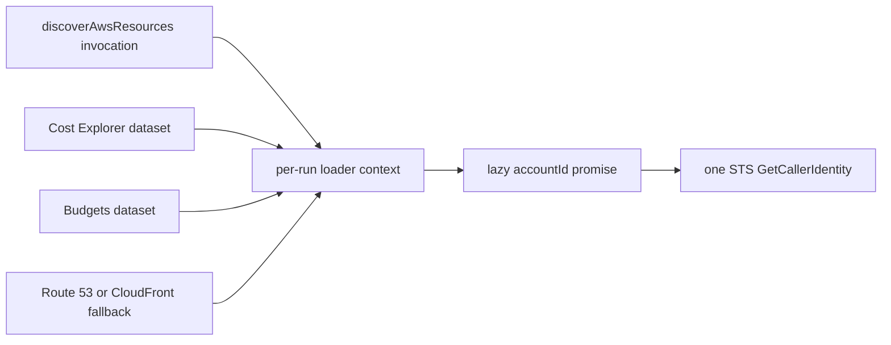

# Discovery Account ID Cache Design

## Summary

Several account-scoped AWS discovery loaders independently call STS `GetCallerIdentity`. Because discovery starts requested datasets concurrently, one run can issue multiple identical STS requests. This change adds one lazy account-ID promise to the existing per-run dataset loader context so all loaders in that run share the same result without leaking identity across credential contexts.

## Goals

- Resolve the AWS account ID at most once per discovery run when one or more datasets need it.
- Keep the cache lazy so runs that do not need an account ID make no STS request.
- Cache the in-flight promise so concurrent loaders share the same request.
- Create a fresh cache for every `discoverAwsResources` invocation.
- Preserve direct hydrator use outside discovery by falling back to `resolveAwsAccountId()` when no loader context is supplied.

## Non-Goals

- Do not cache account IDs module-globally or across discovery runs.
- Do not change ambient credential scoping from `withAwsClientCredentials`.
- Do not add an account-identity discovery dataset or expose identity as rule data.
- Do not change STS retry, timeout, or error behavior.

## Considered Approaches

1. Add a lazy resolver to `AwsDiscoveryDatasetLoadContext`. This is selected because the context already has exactly one discovery-run lifetime and is passed to every dataset loader.
2. Add an `aws-account-identity` dataset. This would reuse dataset memoization but would pollute the rule-facing dataset model with orchestration-only state.
3. Add another `AsyncLocalStorage` cache in the AWS client module. This would hide cache lifetime in ambient state and unnecessarily couple identity memoization to credential transport.

## Design

Extend the internal `AwsDiscoveryDatasetLoadContext` with:

- `resolveAccountId(): Promise<string>`

Inside each `discoverAwsResources` invocation, create a local optional promise and a resolver that initializes it on first use:

```ts
let accountIdPromise: Promise<string> | undefined;

const resolveAccountId = (): Promise<string> =>
  (accountIdPromise ??= resolveAwsAccountId());
```

The same resolver is supplied to every top-level and nested dataset load. The existing dataset promise map and the new account-ID promise therefore share the same run boundary. A rejected STS promise is also shared for the rest of that run, preventing concurrent retry storms; existing dataset error handling converts each affected loader failure into its normal diagnostic.

CloudFront, Cost Explorer, Cost Guardrails, and Route 53 hydrators accept the optional dataset load context. When present, they use `context.resolveAccountId()`. When invoked directly without a discovery context, they call the existing `resolveAwsAccountId()` function as before.

## Data Flow



## Error Handling

- A missing STS account ID continues to throw the existing error.
- An STS rejection is cached only within the current run.
- Dataset loaders retain their existing non-fatal degradation behavior, producing diagnostics when the shared resolver rejects.
- A later discovery run creates a new promise and retries under that run's ambient credentials.

## Testing

Use vertical TDD slices:

1. Add a discovery orchestration test where concurrent account-scoped datasets call the context resolver and assert one underlying `resolveAwsAccountId()` call.
2. Invoke discovery again and assert a second underlying call, proving the cache is per-run rather than global.
3. Update the four resource-loader suites to verify context resolution and direct-call fallback where relevant.
4. Update existing loader-context fixtures for the new resolver method.
5. Run the simplify review and full `pnpm verify` before commit and push to PR #70.

## Tier 2c

Tier 2c is already included on this branch. `docs/architecture/sdk.md` now states that Resource Explorer catalog failures are fatal, while dataset loader failures produce diagnostics, mark datasets unavailable, skip dependent rules, and preserve findings from successful datasets.
