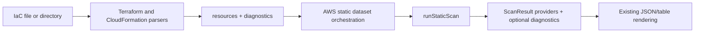

# Static Scan Diagnostics Design

## Summary

Static IaC scans currently keep going when Terraform or CloudFormation input cannot be parsed, but they silently hide the skipped file. This change keeps the non-fatal behavior and adds a diagnostics channel from each parser through the AWS static provider to `ScanResult.diagnostics`.

## Goals

- Report malformed Terraform files as skipped while retaining resources from valid sibling files.
- Report malformed and oversized CloudFormation templates as skipped while retaining resources from valid sibling files.
- Preserve silence for unsupported files and valid YAML or JSON documents that are not CloudFormation templates.
- Return parser resources and diagnostics through one uniform, explicit contract.
- Surface static diagnostics through the existing SDK result and CLI JSON/table formatters.

## Non-Goals

- Do not make parser failures fatal.
- Do not add parser or provider behavior to `@cloudburn/rules`.
- Do not change CLI formatter output beyond supplying diagnostics to its existing rendering path.
- Do not diagnose files that are merely unsupported or valid non-IaC documents.

## Considered Interfaces

1. Return `{ resources, diagnostics }` from every parser. This is the selected approach because it is explicit, composable, and gives static orchestration one consistent contract.
2. Preserve `parseIaC(): IaCResource[]` and add a second internal diagnostics-aware entrypoint. This avoids a public return-shape change but creates two parser paths that can diverge.
3. Accept an optional diagnostics callback. This preserves the resource-array return type but makes composition and testing less direct.

Backward compatibility is not required for this change, so the direct result object is preferable to parallel APIs or callbacks.

## SDK Design

Add an exported parser result type containing:

- `resources: IaCResource[]`
- `diagnostics: ScanDiagnostic[]`

`parseTerraform`, `parseCloudFormation`, and `parseIaC` all return this shape. `parseIaC` runs only the requested source kinds, concatenates their results, and preserves deterministic resource and diagnostic ordering.

Each skipped-file diagnostic uses the existing `ScanDiagnostic` contract:

- `provider: 'aws'`
- `source: 'iac'`
- `status: 'skipped'`
- `service: 'terraform'` or `service: 'cloudformation'`
- a stable code distinguishing Terraform parse failure, CloudFormation parse failure, and oversized CloudFormation input
- a user-facing message containing the scan-relative file path
- parser error text or the size limit in `details` where useful

The file path stays in the message because `ScanDiagnostic` has no path field and changing that shared public type is unnecessary for this task.

`loadAwsStaticResources` returns the static evaluation context together with parser diagnostics. If no active rule requires a static dataset, it returns an empty resource bag and no diagnostics because no parser was requested.

`runStaticScan` evaluates rules against the returned context and attaches `diagnostics` to `ScanResult` only when at least one diagnostic exists, matching `runLiveScan`.

## Data Flow

## Error Handling

- A Terraform HCL parse exception creates one skipped diagnostic for that file and contributes no resources from it.
- A CloudFormation YAML/JSON parse error creates one skipped diagnostic for that file and contributes no resources from it.
- A supported CloudFormation file above 5 MiB creates one skipped diagnostic without reading or parsing the contents.
- Directory traversal continues concurrently, so one invalid sibling cannot suppress valid resources.
- Files with unsupported extensions, Terraform files with no AWS resources, and valid YAML/JSON without a CloudFormation `Resources` map produce neither resources nor diagnostics.

## Testing and Verification

Work in vertical TDD slices:

1. Update the Terraform invalid-syntax test to require one diagnostic while preserving the valid sibling resource, then implement the Terraform result contract.
2. Update the CloudFormation invalid-template test to require one diagnostic while preserving non-fatal behavior, then implement the CloudFormation result contract. Cover the existing oversized-template behavior in the same parser concern.
3. Add `parseIaC` aggregation and deterministic ordering coverage, then thread the result through the static provider.
4. Add a scanner-level test proving `ScanResult.diagnostics` is populated for static scans and omitted when empty.
5. Update package export coverage for the public parser result type and update the stale live-discovery failure statement in `docs/architecture/sdk.md`.
6. Run the required simplify review and a fresh `pnpm verify` before each implementation commit and final handoff.

## Release

This is a patch fix for `@cloudburn/sdk`, with one SDK changeset. No CLI package changeset is needed because the existing formatter already supports `ScanResult.diagnostics`.
